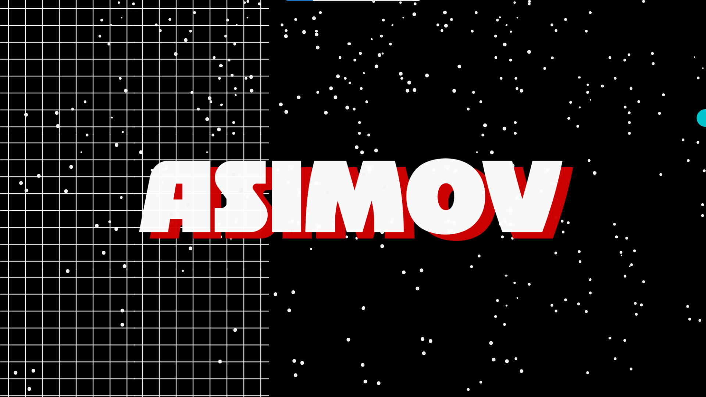

# Documentação IoTDoc - Módulo 4 - Inteli

## Asimov

#### Nomes dos integrantes do grupo

- <a href="https://www.linkedin.com/in/fernando-antonio-s-c-de-vasconcellos/">Fernando Antonio Sampaio Cabral de Vasconcellos</a>
- <a href="https://www.linkedin.com/in/naruto/">Ivan Fellipy Gonçalves Ferreira</a>
- <a href="https://www.linkedin.com/in/kaleb-carvalho/">Kaleb Isaias Souza de Carvalho</a>
- <a href="https://www.linkedin.com/in/keylla-oliveira1206/">Keylla Cristina Oliveira Bispo</a>
- <a href="https://www.linkedin.com/in/lidia-mariano-b68282264/">Lídia Cruz Mariano</a>
- <a href="https://www.linkedin.com/in/lucasbmr/">Lucas Bittencourt Moraes Rego</a> 
- <a href="https://www.linkedin.com/in/michel-menahem-khafif-512791201/">Michel Menahem Khafif</a>

## Sumário

[1. Introdução](#c1)

[2. Metodologia](#c2)

[3. Desenvolvimento e Resultados](#c3)

[4. Possibilidades de Descarte](#c4)

[5. Conclusões e Recomendações](#c5)

[6. Referências](#c6)

 

# 1. Introdução 

&emsp;Localizado no município de São Paulo, na Cidade Universitária Armando de Salles Oliveira, o Instituto de Pesquisas Tecnológicas(IPT) atua, desde 1899, quando foi fundado, criando e aplicando soluções tecnológicas. Essas soluções destinam-se a setores da economia, do governo e da sociedade nos mais diversos segmentos, como energia, transportes, petróleo & gás, meio ambiente, construção civil, saúde e segurança. O instituto está vinculado ao Governo do Estado de São Paulo e colabora para o desenvolvimento nacional em apoio à superação de desafios, sendo uma das maiores instituições de pesquisa e de desenvolvimento tecnológico do país.[1]

&emsp;O Setor de Obras Civis dessa instituição, que atua principalmente no segmento de Infraestrutura, enfrenta um problema relacionado ao desenvolvimento de um módulo capaz de ler os dados provenientes de células de carga, exibir esses dados em um display, armazená-los internamente e transmiti-los para um computador ou uma plataforma de armazenamento em nuvem. O princípio do problema é o desenvolvimento desse equipamento de maneira pouco onerosa, de modo a ser uma alternativa para os equipamentos de alto custo que estão no mercado(que são em torno de 100 mil reais), desse modo tornando o monitoramento de obras civis mais acessível e econômico.[4]

## 1.1 Objetivos

&emsp;Este projeto tem objetivos gerais e específicos de acordo com a expectativa do IPT, o parceiro de negócios. Entre os objetivos gerais, estão:
1. Reduzir o custo dos equipamentos utilizados no monitoramento de obras civis: um dos principais objetivos macros é chegar a um produto que tenha um custo menor do que os equipamentos já utilizados, que são bastante onerosos.
2. Empregar comunicação sem fio entre os dispositivos: comunicação sem fio diminuiu a necessidade de passagem de cabos, simplificando o trabalho das equipes responsáveis pela instalação dos equipamentos.

&emsp;Já nos objetivos específicos, figuram:
1. Traduzir os dados para unidades de medida compreesíveis: os componentes que são utilizados para a medição trabalham com medidas de deslocamento. Para melhor entendimento, é ideal que as medidas sejam convertidas para uma grandeza de peso, a exemplo de Newton.
2. Armazenar os dados de seis meses de medições: persistir as medições é outro objetivo importante para fins de consulta e análise de padrões. O intervalo de tempo preferível, conforme indicação do parceiro, é de seis meses.
3. Apresentar os valores o mais próximo do tempo real: a visualização imediata das medições também é de grande importância. Deve-se, então, apresentar os valores das medições, em tempo real, em um display que será acoplado no equipamento, bem como seus valores diários no ambiente em nuvem.

## 1.2 Proposta da solução

&emsp;A solução foi pensada levando-se em consideração os objetivos gerais e específicos do projeto, bem como outras expectativas do parceiro de negócios. Ela consiste, resumidamente, em um dispositivo condicionador de sinal que, além de converter medições de deslocamento para uma unidade de medida de peso comumente utilizada no segmento de obras civis, ainda é capaz de se comunicar com um "access point" e com a internet a fim de permitir o calibramento do equipamento de forma remota e a persistência dos dados.

&emsp;Em relação ao modo como a proposta de solução atenderá aos objetivos listados na seção anterior, é possível dizer que cumprirá facilmente os objetivos gerais. Isso porque ela contará com a utilização de componentes eletrônicos pouco onerosos e microcontroladores como Arduino e ESP32, que contém módulo integrado para comunicação sem fio wifi.

&emsp;Por fim, a proposta de solução também visa cumprir com os objetivos que são um pouco mais específicos. Então, ela contará com um algoritmo personalizado a fim de atender à regra de negócio referente à conversão da unidade de medida dos dados, além de contar com a utilização de cartões SD designados ao armazenamento dos seis meses de medições. Já para a apresentação dessas medições, a proposta de solução incluirá um display LCD, bem como uma plataforma online de computação em nuvem onde haverá a possibilidade, também, de consultar dashboards.

## 1.3 Justificativa

&emsp;A proposta de solução representa, do modo como foi pensada e será aplicada, uma completa e adequada resolução para o problema que o parceiro de negócios, o IPT, enfrenta. Primeiro, vale lembrar que a solução empregará componentes eletrônicos pouco onerosos, o que implica diretamente a diminuição do custo do projeto, que será expressivamente mais barato do que os equipamentos já utilizados no mercado. Além disso, uma característica que traduz o modo como a solução é multifacetada é a implementação de comunicação sem fio, que traz, entre outros benefícios, uma simplificação no momento de instalação do aparelho nos locais da obra civil.

&emsp;Além disso, a solução diferencia-se, também, na apresentação dos dados. Por meio de uma aplicação web hospedada em um servidor proveniente de computação em nuvem, as medições poderão ser visualizadas de maneira intuitiva, com auxílio de dashboards. Essa visualização contribuirá imensamente para a etapa de análise de dados, que, por sua vez, será possível por intermédio de tecnologias habilitadoras.

# 2. Metodologia 

## 2.1 RM-ODP

### 2.1.1 O que é o RM-ODP?

&emsp;O RM-ODP é um padrão composto por normas e diretrizes, as quais foram desenvolvidas pela International Organization for Standardization (.ISO) e a Comissão Eletrotécnica Internacional (IEC). Sua origem se dá devido a necessidade de trazer consistência, portabilidade e interoperabilidade de sistemas embarcados. Sendo assim, criam-se cinco visões distintas para compreender o conjunto do sistema, a visão empresarial, tecnológica, computacional, de engenharia e de informação. Cada uma dessas aborda uma diferente perspectiva do todo, para trazer as necessidades e respeitar as normas estabelecidas.[2]

### 2.1.2 Por que o RM-ODP?

&emsp; O uso do RM-ODP auxilia a compreender as diferentes perspectivas existente dentro de um sistema embarcado, com a finalidade de aproximar os desenvolvedores da solução aos stakeholders, usuários finais do produto e outras partes envolvidas no projeto. Ao utilizar dos diferentes pontos de vistas do modelo, é possível notar informações relevantes para cada aspecto do projeto e focar nelas, trazendo detalhes importantes à cada parte.[3]

### 2.1.3 Enterprise View (Ponto de vista Empresarial)

&emsp;A visão empresarial do Reference Model for Open Distributed Processing (RM-ODP) se concentra em fornecer uma estrutura para o design e a especificação de sistemas distribuídos que atendam efetivamente aos objetivos e às necessidades das organizações. Seu foco está nas estratégias, processos de negócios, políticas organizacionais e requisitos empresariais. Essa abordagem ao projeto consegue atingir as preocupações por meio de suas camadas e conceitos fundamentais, além de permitir o alinhamento e  arquitetura de sistemas distribuídos com as metas de negócios, promovendo eficácia organizacional e adaptabilidade a mudanças nos objetivos empresariais. [2]

#### 2.1.3.1 Objetivos do Projeto:

&emsp;Essa seção da visão empresarial traz os principais tópicos e finalidades do projeto, sintetizando os principais objetivos. Sendo assim, ela é constituída pelos desejos do cliente, acordados ao contratado através de um documento assinado por ambos, nesse caso o TAPI (Termo de Abertura de Projeto Interno) [4].

&emsp;O projeto tem como objetivo a criação de um dispositivo capaz de realizar medições na variação de peso em uma estrutura civil, através do uso de célula de cargas,pois a demanda primordial é a redução de custos dos equipamentos utilizados no monitoramento de obras civis e facilitar a instalação utilizando comunicação sem fio entre os dispositivos.

#### 2.1.3.2 Escopo e Limites do Projeto:

&emsp;O tópico visa trazer quais serão os principais pontos  abordados dentro do projeto. Assim, busca-se garantir uma compreensão compartilhada e clara do que o projeto visa realizar, além de estabelecer bases para o desenvolvimento e implementação bem-sucedidos de sistemas distribuídos.

&emsp;Desenvolvimento de um protótipo funcional utilizando microcontroladores (ESP32) para substituir equipamentos de custos elevados.

&emsp;Módulo completo com ESP32, display integrado e célula de carga. Sendo esse módulo capaz de realizar leituras, exibições, armazenamento e transmissão de dados.

&emsp;Software responsável pela visualização dos dados, provenientes do módulo, de forma remota e totalmente online, sem a necessidade de manusear o equipamento fisicamente.

#### 2.1.3.3 Limitações e Restrições:

&emsp;É importante detalhar as limitações e restrições do projeto, pois permite uma tomada de decisão baseada em fatos e problemas já definidos durante o planejamento e execução do projeto. Com isso, garante-se o alinhamento com as capacidades e restrições do grupo. Isso contribui para um desenvolvimento mais eficiente e eficaz de sistemas distribuídos dentro do contexto empresarial.

&emsp;O projeto tem um prazo máximo de 10 semanas, sendo o desenvolvimento de todo protótipo limitado a esse prazo.

&emsp;Devido às necessidades de conexão via Wi-Fi, o microcontrolador que deve ser utilizado é o esp32.

&emsp;A célula de carga disponível para os testes no protótipo se restringe a 5Kg, diferentemente das utilizadas nas obras.

#### 2.1.3.4 Informação Crítica para o Negócio:

&emsp;Para a construção de uma solução adequada, é importante ter claras as informações vitais para o projeto. Sendo assim, o tópico aborda quem utilizará o produto, uso de produtos anteriores, como a empresa se porta e outros  conhecimentos vitais para garantir o sucesso.

&emsp;Principais usuários: A equipe especializada composta por técnicos e engenheiros estruturais, geotécnicos e geólogos que atuam de modo colaborativo e integrado às demais especializações existentes no IPT.

&emsp;A instituição atua de modo a respeitar a hierarquia presente na empresa, porém dentro dos projetos é essencial a constante troca de informações entre técnicos e engenheiros para garantir a eficácia do monitoramento de obras civis.

#### 2.1.3.5 Requisitos de Negócios:

&emsp;Os requisitos de negócios, auxiliam a organização a alinhar as características de qualidade do software definidas pela ISO 25010 com as metas e objetivos específicos do produto. Isso contribui para o desenvolvimento de sistemas distribuídos que atendem não apenas aos requisitos funcionais, mas também garantem a qualidade e desempenho necessários para o sucesso empresarial.

&emsp;Os requisitos não funcionais são os itens necessários para o desenvolvimento de um bom projeto mas que não são requisitados pelo cliente. Sendo assim, eles são baseados na ISO 25010. Tal fato se deve, pois ela visa garantir todos os recursos para um IoT de qualidade.

&emsp;Dentre os requisitos, os tópicos presentes foram: Segurança; Confiabilidade; Usabilidade; Disponibilidade; Configurabilidade do Sensor Físico; Visualização de Dados Históricos; Conectividade Ilimitada de Dispositivos; Conformidade Legal; Acessibilidade da Interface.

### 2.1.4 Computational Viewpoint (Ponto de Vista Computacional)

&emsp;Este ponto de vista no RM-ODP se concentra na modelagem lógica dos processos distribuídos em um sistema. Ele aborda como as funções e os comportamentos dos processos são especificados para atender aos requisitos do sistema. Ademais, foca em abstrair os conceitos de software em alto nível para que possa ser implementado em todos os dispositivos. [2]

#### 2.1.4.1 Especificação de Processos:

&emsp;A especificação de processos do ponto de vista computacional da RM-ODP é fundamental para o desenvolvimento do projeto. Ela orienta a definição, responsabilidades e lógica interna dos processos envolvidos na coleta, processamento e transmissão de dados da célula de carga para apresentação em um dispositivo. Isso inclui a especificação de como cada processo captura dados, processa essas informações e comunica-os eficientemente ao sistema. A interação entre esses processos é crucial para assegurar a coleta precisa e a transmissão confiável dos dados, garantindo que sejam apresentados corretamente no computador. Esta abordagem não só facilita uma colaboração eficiente entre os componentes do sistema, mas também garante a integridade e precisão dos dados coletados pela célula de carga.

#### 2.1.4.2 Comportamentos e Interações:

&emsp;No âmbito do projeto, a visão computacional da RM-ODP, focada em "Comportamentos e Interações", modela como os processos interagem entre si para realizar as operações necessárias. Essa modelagem é essencial para entender como a célula de carga comunica dados ao dispositivo, abrangendo desde a captação de leituras de carga até a apresentação desses dados. Além disso, define comportamentos específicos associados a eventos e estados do sistema, como a resposta a variações de carga ou falhas de comunicação. Este enfoque garante que o sistema seja não só eficiente e preciso na coleta e transmissão de dados, mas também robusto em termos de gestão de eventos e estados, assegurando a confiabilidade e eficácia do projeto como um todo.

#### 2.1.4.3 Serviços e Interfaces:

&emsp;A seção Serviços e Interfaces especifica os serviços oferecidos por cada processo envolvido no sistema, sendo assim um guia para identificar os serviços presentes no sistema embarcado, assim como para entender seu funcionamento. Ademais, o trecho delimita como esses serviços podem ser acessados por outros processos.

&emsp;A transmissão de dados para o computador através do microcontrolador é um serviço o qual é realizado pelo sistema através de um protocolo de troca de informações. Essa comunicação acontece através de uma via de mão única, na qual o computador/nuvem receberá informações enviadas pelo microcontrolador em uma quantia de tempo intervalar.

#### 2.1.4.4 Integração de Componentes:

&emsp;A Integração de Componentes foca em como os diferentes componentes, da célula de carga ao software de processamento, são integrados para criar um sistema unificado. Isso inclui definir APIs e protocolos de comunicação, facilitando a transferência e gestão de dados entre o microcontrolador e o servidor, assegurando uma operação coesa do sistema.

&emsp;No projeto a integração acontece a partir da escolha do método de comunicação, que nesse caso foi utilizado o MQTT(Message Queuing Telemetry Transport). Além disso, há a busca pela segurança da informação e garantindo uma plataforma segura.

#### 2.1.4.5 Flexibilidade e Adaptação:

&emsp;Na visão computacional da RM-ODP do projeto, a Flexibilidade e Adaptação foca na capacidade do sistema em adaptar-se a mudanças nos requisitos ou ambiente operacional. Inclui mecanismos para atualização de software e reconfiguração do sistema, garantindo que a célula de carga possa evoluir e manter-se relevante e eficaz diante de novas necessidades ou avanços tecnológicos.

### 2.1.5 Technology Viewpoint (Ponto de vista tecnológico)

&emsp;No ponto de vista tecnológico, a ênfase está em como os recursos tecnológicos são organizados para suportar as funcionalidades distribuídas do sistema. De forma mais detalhada, o ponto de vista tecnológico busca conectar o mundo físico ao software, trazendo as necessidades, limitações e ambiente físico no qual o sistema será implementado. [2]

#### 2.1.5.1 Hardware:

&emsp;Descreve quais são os dispositivos físicos, como computadores, servidores, roteadores, etc., que compõem a infraestrutura do sistema distribuído.  

&emsp;No protótipo há presente sensores como célula de carga e sensor de temperatura e pressão, além de displays como Leds e Lcd. Esses dispositivos são controlados através de um microcontrolador já escolhido, nesse caso o ESP32. Para a comunicação do microcontrolador com outros dispositivos é utilizado um módulo para ESP32, que é composto por uma antena e um fio para conectar ao microcontrolador.

#### 2.1.5.2 Protocolos:

&emsp;Detalha os padrões de comunicação utilizados entre os componentes distribuídos para garantir a interoperabilidade.

&emsp;É utilizado o MQTT (Message Queuing Telemetry Transport), um protocolo de comunicação leve e eficiente projetado para facilitar a troca de mensagens entre dispositivos em redes com largura de banda limitada. Esse padrão de comunicação é desenvolvido para aplicações de IoT (Internet of Things) e sistemas distribuídos. De tal forma que o MQTT opera sobre o modelo de publicação/assinatura, ou seja, os microcontroladores podem publicar mensagens em tópicos específicos e se inscreverem para receberem mensagens em tópicos de seu interesse.

&emsp;Sua natureza assíncrona e de baixa sobrecarga torna-o ideal para ambientes com recursos restritos, permitindo a comunicação eficiente e confiável entre dispositivos conectados, sendo amplamente adotado para a implementação de soluções IoT escaláveis e interoperáveis.

### 2.1.6 Engineering Viewpoint (Ponto de Vista de Engenharia)

&emsp;O ponto de vista de Engenharia concentra-se nos aspectos práticos e técnicos da implementação do sistema distribuído. Ele está preocupado com a tradução das decisões de design em uma implementação real e efetiva. Com isso, seu enfoque está em conseguir trazer a abstração do ponto de vista computacional para a implementação, compreendendo as necessidades dos dispositivos que serão utilizados.[2]

#### 2.1.6.1 Linguagens de Programação:

&emsp;Para a implementação do projeto está sendo utilizado somente a linguagem c++. Essa é utilizada em sistemas embarcados pela sua facilidade de lidar com esse tipo de hardware, além de suas funções que permitem interagir com alocação de memória, portas físicas e outputs para sistemas físicos.

#### 2.1.6.2 Frameworks e Bibliotecas:

&emsp;Define os frameworks e bibliotecas de software que são empregados para facilitar o desenvolvimento de componentes distribuídos.

&emsp;São utilizadas diversas bibliotecas, como ada Adafruit_BME280_Library, Adafruit_BusIO,  Adafruit_Unified_Sensor, HX711_Arduino_Library, LiquidCrystal_I2C, PubSubClient, esp32-mqtt-main e a biblioteca Wifi. As bibliotecas permitem integrar o microcontrolador aos sensores e atuadores existentes no circuito, além do módulo wi-fi utilizado nele.

#### 2.1.6.3 Ferramentas de Desenvolvimento:

&emsp;Aborda as ferramentas utilizadas no processo de desenvolvimento, como ambientes de desenvolvimento integrado (IDEs), depuradores, compiladores, etc. Assim detalha-se o ambiente que é necessário para futuras alterações no código, assim como manutenções.

&emsp;Para o desenvolvimento do projeto está sendo utilizadas duas IDEs, o Visual Studio Code e o Arduino Ide. Além disso, o Arduino IDE já vem com compilador, assim como a extensão de c++ presentes no visual studio code.

#### 2.1.6.4 Padrões de Codificação:

&emsp;Define padrões de codificação para garantir consistência e boas práticas ao desenvolver os componentes distribuídos. Isso traz uma unificação no código, permitindo uma fácil manutenção do sistema.

&emsp;Está sendo utilizado o português tanto para a nomeação de variáveis, criação de método quanto para comentar o código realizado. Além disso, estão sendo utilizados padrões de programação orientada a objetos.

#### 2.1.6.5 Controle de Versão:

&emsp;Aborda as práticas e ferramentas relacionadas ao controle de versão do software, garantindo o rastreamento e gerenciamento eficientes das mudanças no código-fonte.

&emsp;Para o controle de versão está sendo utilizado o padrão git, no qual é utilizado o site github para fazer o controle de versões. Dentro dele, foi escolhido o uso de branches, o qual permitem o desenvolvimento de diferentes features ao mesmo tempo sem causar conflito de versões entre arquivos.

#### 2.1.6.6 Documentação Técnica:

&emsp;Especifica os requisitos e práticas para a documentação técnica, essencial para a compreensão e manutenção do sistema distribuído. Com isso, permite uma usabilidade mais fácil ao usuário pois simplifica o processo de uso criando explicações para possíveis acontecimentos no sistema e como agir mediante à eles.

&emsp;Para a documentação técnica está previsto a criação de um manual de uso do protótipo para que guie o usuário quando ele for utilizar de nossa solução. Com isso, o usuário final terá uma melhor experiência final ao compreender.

### 2.1.7 Information Viewpoint (Ponto de vista de informação)

&emsp;O objetivo principal do ponto de vista da Informação é garantir que os dados sejam gerenciados de forma eficaz, compreensível e consistente em um ambiente distribuído. Isso facilita a interoperabilidade entre os diferentes componentes do sistema, garantindo que todos compreendam e utilizem os dados de maneira consistente. Além disso, ajuda a garantir a qualidade e a confiabilidade das informações em todo o sistema distribuído. [2]

#### 2.1.7.1 Modelo Comum:

&emsp;Para o ponto de vista da informação, existe a necessidade de um modelo comum de informações acessível em todo o projeto. Isso visa garantir a consistência da informação em todos os designs existentes no projeto.

&emsp;É importante para o projeto a garantia de UX claro e comum para todos os dispositivos, assim garantindo a Interusabilidade entres eles. Sendo assim, é importante que a informação mostrada através de um dispositivo seja consistente e apareça de forma semelhante ou igual em outro garantindo sua integridade. Para isso, o display, que está instalado no protótipo físico, apresenta a informação de forma que seja possível associá-la ao que é mostrado no software.

#### 2.1.7.2 Prevenção de Divergências e Coleta Incompleta de Informações:

&emsp; Esse tópico se conecta de forma direta ao 2.1.7.1, pois ao utilizar de um modelo comum trabalha-se diretamente na prevenção de divergências e coleta incompleta de informações. A coleta incompleta de informações, traz riscos ao projeto por instruir a tomada de decisões errôneas. Além disso, as divergências em informações podem causar uma dificuldade na usabilidade, interoperabilidade e na experiência do usuário como um todo. 

&emsp;Com a coleta de informações diretas de um microcontrolador atuando em um sistema físico, é relevante tratar sobre prevenção de divergências e falhas na coleta de informação. Por isso, foi identificado através dos desenhos esquemáticos momentos, nos quais podem ocorrer falhas e coletas incompletas de informações.
 
#### 2.1.7.3 Desafios da Federação de Sistemas e Integração de Sistemas Legados:

&emsp;Uma funcionalidade importante quando se implementa um novo projeto é a manutenção de sistemas pré-existentes assim como o histórico de dados, para que se possa evitar a perda de medidas importantes.

&emsp;Foi tratado de forma direta com o cliente sobre a existência de sistemas legados, e percebeu-se que é inviável a manutenção de um sistema legado, devido a falta de um padrão no armazenamento de informações, as quais eram armazenadas via excel.

### 2.1.8 Conclusão 

&emsp; Em resumo, a aplicação do modelo RM-ODP (Reference Model for Open Distributed Processing) em um projeto de sistema embarcado oferece uma estrutura sólida e abrangente para o desenvolvimento e a integração de sistemas distribuídos complexos. Ao adotar os conceitos de interoperabilidade, modularidade e separação de preocupações propostos pelo RM-ODP, é possível alcançar uma arquitetura robusta e flexível para sistemas embarcados. Em última análise, a utilização do RM-ODP proporciona uma base sólida para o desenvolvimento eficiente e escalável de sistemas embarcados, atendendo às demandas crescentes de complexidade e integração na era da computação distribuída.

# 3. Desenvolvimento e Resultados 

## 3.1. Domínio de Fundamentos de Negócio

### 3.1.1. Contexto da Indústria 

&emsp;O IPT opera com um modelo de negócio que combina financiamento público e parcerias privadas. Seu foco principal é o desenvolvimento de pesquisa aplicada, visando impulsionar a inovação em diversos setores da indústria brasileira. Ao lado disso, oferece consultoria, ensaios laboratoriais e serviços tecnológicos, desempenhando um papel crucial na transferência de tecnologia e no fortalecimento da competitividade industrial do país.

&emsp;O setor de pesquisa tecnológica está em constante evolução, moldado através da rápida transformação da era digital e demandas crescentes de sustentabilidade. A potencial integração entre inteligência artificial, big data e Internet das Coisas (IoT) tem desafiado institutos de pesquisa a desenvolver soluções melhor integradas e multifuncionais. 

&emsp;No campo altamente especializado da pesquisa tecnológica no Brasil, o IPT destaca-se como um dos pilares centrais. Apesar de não ter nenhuma concorrência acirrada, compete com instituições renomadas como o Instituto Nacional de Tecnologia (INT) e o Centro de Tecnologia da Informação Renato Archer (CTI), ambos com expressivas contribuições em diferentes áreas da ciência e tecnologia. Adicionalmente, universidades com forte tradição em pesquisa, como a Universidade de São Paulo (USP), também entram no radar, dada a amplitude e profundidade de seus projetos de pesquisa.

Figura 1 - 5 forças de Porter

    

Fonte: Elaborada pelos autores

Rivalidade entre concorrentes:

-Número e Diversidade de Concorrentes: Podem haver vários centros de pesquisa competindo por financiamento, talento e reconhecimento.

-Crescimento do Setor: Por se tratar de um crescimento lento, a concorrência pode se intensificar, pois os centros podem competir agressivamente por uma participação maior em um mercado estático.

-Diferenciação: Centros de pesquisa com instalações, talentos ou especializações únicas podem ter uma vantagem competitiva.Existem outras empresas e institutos que produzem células de carga. A competição é baseada em precisão, confiabilidade, durabilidade, preço e serviços pós-venda.

Ameaça de novos entrantes:

-Barreiras de Entrada: Estabelecer um novo projeto de pesquisa exige capital significativo, talento especializado e, muitas vezes, um longo período de tempo para ganhar reconhecimento. Tais fatores representam barreiras de entrada.

-Reputação: Centros de pesquisa estabelecidos, com histórico de publicações de alto impacto e colaborações significativas como o IPT possui, têm uma vantagem inerente sobre novos entrantes.

Ameaça de produtos substitutos:

-Digitalização e IA: A ascensão da inteligência artificial e da digitalização, por exemplo, podem representar uma ameaça, facilitando futuros projetos de pesquisa, criando simuladores e sistemas de monitoramento que substituem os tradicionais.

Poder de negociação dos fornecedores:

-Diversidade de Empresas : O poder de barganha dos fornecedores é algo menos denso na área de pesquisa de construção civil do IPT. Isso se deve ao fato do setor abranger uma grande variedade de empresas fornecedoras de grande, médio e pequeno porte, desde que ofereçam produtos de qualidade.

Poder de negociação dos compradores:

-Fontes de Financiamento: Organizações que financiam pesquisa (governos, empresas, ONGs) têm poder de negociação, pois os centros de pesquisa dependem desses fundos.

-Colaborações: Grandes empresas ou instituições que buscam colaborações podem ter poder de barganha caso mais de um centro de pesquisa desejar colaborar com eles.

### 3.1.2. Análise SWOT 	

&emsp;A Matriz SWOT é uma ferramenta estratégica utilizada para avaliar as forças (Strengths), fraquezas (Weaknesses), oportunidades (Opportunities) e ameaças (Threats) de um projeto ou organização. Por meio dela, é possível identificar pontos internos positivos e negativos, bem como fatores externos que podem influenciar o sucesso ou fracasso de uma iniciativa. Através dessa análise, organizações e projetos, como o do IPT, podem desenvolver estratégias mais informadas e robustas, capitalizando sobre seus pontos fortes e mitigando riscos potenciais.

Figura 2 - Análise SWOT

    

Fonte: Elaborada pelos autores

- Equipe Especializada: A SOC tem técnicos e engenheiros experientes. 

- Bons Equipamentos: Possuem laboratórios e equipamentos para testar novas tecnologias. 

- Bons Contatos: Trabalham com muitas empresas e o governo na área de infraestrutura. 

- Equipamentos Caros: Os equipamentos de monitoramento tradicionais tem um alto custo. 

- Problemas de Conexão: É difícil conectar os equipamentos em lugares distantes, além do fraco acesso à internet também ser um problema. 

- Falta de Experiência com Arduino: Dificuldade em programar no ambiente do Arduino. 

- Tecnologia Mais Barata: O uso do Arduino/ESP32 irá baratear os custos do monitoramento, sendo esse um dos principais objetivos do projeto. 

- Novos Serviços: Se o projeto der certo, podem oferecer um serviço de monitoramento inovador e também atender mais clientes. 

- Melhorias no Monitoramento de Obras: O projeto pode ajudar a melhorar a segurança das obras. 

- Clima Ruim: O clima pode danificar os equipamentos. 

- Resistência à Nova Tecnologia: Pode existir resistência ao usar a nova tecnologia, sendo necessário talvez treinamento e instrução prévia às equipes. 

- Novos entrantes: Empresas inovadoras tornam a tecnologia mais evoluída, acessível e fácil de usar.

### 3.1.3. Descrição da Solução a ser Desenvolvida 

#### 3.1.3.1 Qual é o problema a ser resolvido
&emsp;O monitoramento de estruturas, como pontes e edifícios, com Células de Carga enfrenta desafios significativos. Os equipamentos tradicionais são caros e complexos.Com uma instalação na qual requer extensos cabos, sistemas de energia robustos e medidas de segurança para proteger os equipamentos de danos, roubo e intempéries. Esses fatores elevam os custos e complicam a viabilidade do monitoramento contínuo em obras civis no Brasil.

#### 3.1.3.2 Qual a solução proposta (visão de negócios)
&emsp;Diante dos desafios apresentados no monitoramento de estruturas, a solução proposta visa reduzir custos e simplificar o processo ao implementar uma comunicação sem fio entre os dispositivos, por meio de um protótipo utilizando IoT. Tornando o mais ágil . Além disso, a utilização de tecnologia sem fio pode minimizar a dependência de infraestruturas de energia complexas e reduzir a vulnerabilidade a danos e roubos, já que os equipamentos se tornam menos visíveis e intrusivos. Com essa visão de negócios, busca-se tornar o monitoramento de obras civis mais acessível e eficiente, de modo que consiga atingir uma maior gama de clientes e aplicações. Assim, alinha-se à necessidade de inovação no setor, por meio de um protótipo IoT.

#### 3.1.3.3 Como a solução proposta deverá ser utilizada
&emsp;A solução sem fio proposta envolve a instalação de Células de Carga equipadas com módulos de comunicação nos pontos estratégicos das obras. Estes dispositivos transmitem dados diretamente para uma central de monitoramento, eliminando cabos e infraestruturas adicionais. A central, por sua vez, permitirá análises em tempo real, ajudando na tomada de decisões ágeis. Para manter a eficácia do sistema, verificações e manutenções periódicas nas unidades são essenciais.

#### 3.1.3.4 Quais os benefícios trazidos pela solução proposta
&emsp;A introdução da solução sem fio traz consigo múltiplos benefícios para o monitoramento de estruturas civis. Primeiramente, reduz-se significativamente o custo geral, pois elimina-se a necessidade de investimento em materiais caros e complexos. A instalação se torna mais ágil e menos invasiva, otimizando o tempo de implementação. A flexibilidade da tecnologia sem fio permite monitorar um número maior de pontos. Além disso, ao reduzir a dependência de infraestrutura física, minimiza-se o risco de danos e roubo de equipamentos. Por fim, o acesso em tempo real aos dados potencializa a tomada de decisão informada, reforçando a segurança e eficácia das intervenções em obras monitoradas.

#### 3.1.3.5 Qual será o critério de sucesso e qual medida será utilizada para o avaliar
&emsp;O critério de sucesso para esta solução estará fundamentado na sua capacidade de oferecer monitoramento eficiente e confiável, aliado à redução de custos e complexidade. A medida primária de avaliação será a consistência e precisão dos dados transmitidos em comparação com os sistemas tradicionais cabeados. Isso pode ser quantificado por meio de testes comparativos que avaliem a acurácia e confiabilidade da informação. Além disso, o retorno sobre o investimento (ROI) servirá como indicador financeiro, comparando os custos iniciais e operacionais da solução sem fio com os sistemas tradicionais. Feedbacks dos usuários, taxa de falhas do sistema e tempo médio para instalação também serão métricas valiosas.
	
### 3.1.4. Value Proposition Canvas 

&emsp;O Value Proposition Canvas é uma ferramenta de planejamento estratégico que ajuda as empresas a entenderem melhor o que seus clientes valorizam e como podem criar valor para eles. A ferramenta é composta por dois blocos principais: o bloco do Perfil do Cliente e o bloco da Proposta de Valor.[5]

&emsp;O bloco do Perfil do Cliente ajuda a entender melhor as necessidades, desejos e frustrações dos clientes. Ele também ajuda a segmentar os clientes em grupos distintos e a identificar os segmentos de clientes mais atraentes para o negócio. Isso é possível por meio de três seções: "Customer Jobs", referente às tarefas que o clinete necessita realizar; "Pains", referente às dores que o cliente tem no exercício de cumprir com as tarefas; e "Gains", referente aos ganhos, mensuráveis ou não, de que o cliente precisa. [5]

&emsp;Por outro lado, o bloco da Proposta de Valor auxilia na identificação dos benefícios oferecidos aos clientes e como esses benefícios se diferenciam dos concorrentes. Da mesma forma, isso é realizado por outras três seções: "Products & Services", referente às funcionalidades que a solução proposta efetivamente vai oferecer aos clientes; "Pain Relievers", referente às dores que serão aliviadas pela solução; e, finalmente, "Gain Creators", referente aos ganhos que de fato serão proporcionados pela solução.[5]

Figura 3 - Value Proposition Canvas

    

Fonte: Elaborada pelos autores

&emsp;Para o caso do projeto de condicionador de sinal voltado para a necessidade do IPT de baratear o equipamento e deixá-lo não apenas conveniente, como também mais eficiente, o Value Proposition Canvas foi realizado de modo a objetivamente expressar as necessidades do parceiro, além de expressar a proposta de valor pretendida pela solução do grupo, como é possível examinar na Figura 3 acima. 

### 3.1.5. Matriz de Riscos 

#### Matriz de Risco de Oportunidades

&emsp;A Matriz de Risco de Oportunidades é uma ferramenta destinada a ajudar organizações e projetos a avaliar e priorizar oportunidades. Esta matriz leva em consideração dois critérios: a probabilidade de uma oportunidade materializar-se e o impacto positivo que ela traria se concretizada. Oportunidades são plotadas na matriz permitindo visualizar quais devem ser perseguidas primeiro, devido ao seu alto impacto potencial e alta probabilidade de ocorrência. 

Figura 4 - Matriz de Risco de Oportunidades

    

Fonte: Elaborada pelos autores

#### Matriz de Risco de Ameaças
 
&emsp;A Matriz de Risco de Ameaças, por outro lado, concentra-se em identificar e avaliar potenciais ameaças ou desafios que um projeto ou organização pode enfrentar. Assim como na matriz de oportunidades, dois critérios são considerados: a probabilidade da ameaça ocorrer e o impacto negativo que ela poderia ter. Ameaças são posicionadas na matriz para determinar quais necessitam de estratégias de mitigação imediatas, dada sua alta probabilidade e alto impacto potencial.

Figura 5 - Matriz de Risco de Ameaças

    

Fonte: Elaborada pelos autores

### 3.1.6. Política de Privacidade de acordo com a LGPD 	

#### 3.1.6.1 Informações gerais sobre a empresa / organização

&emsp;O Instituto de Pesquisas Tecnológicas, pessoa jurídica de direito privado, com sede na Av. Prof. Almeida Prado, 532 - Butantã, São Paulo, inscrita no CNPJ/MF sob o nº 60.633.674/0001-55 leva a sua privacidade a sério e zela pela segurança e proteção de dados de todos os seus clientes, parceiros e fornecedores.

#### 3.1.6.2 Informações sobre o tratamento de dados

&emsp;Esta Política de Privacidade (“Política de Privacidade”) destina-se a informá-lo sobre o modo como nós utilizamos e divulgamos informações coletadas em suas visitas à nosso site e em mensagens que trocamos com você (“Comunicações”).

AO ACESSAR O SITE, ENVIAR COMUNICAÇÕES OU FORNECER QUALQUER TIPO DE DADO PESSOAL, VOCÊ DECLARA ESTAR CIENTE E DE ACORDO COM ESTA POLÍTICA DE PRIVACIDADE, A QUAL DESCREVE AS FINALIDADES E FORMAS DE TRATAMENTO DE SEUS DADOS PESSOAIS QUE VOCÊ DISPONIBILIZAR NO INSTITUTO
Esta Política de Privacidade fornece uma visão geral de nossas práticas de privacidade e das escolhas que você pode fazer, bem como direitos que você pode exercer em relação aos Dados Pessoais tratados por nós. Se você tiver alguma dúvida sobre o uso de Dados Pessoais, entre em contato com ipt@ipt.br.

&emsp;Além disso, a Política de Privacidade não se aplica a quaisquer aplicativos, produtos, serviços, site ou recursos de mídia social de terceiros que possam ser oferecidos ou acessados por meio do Instituto. O acesso a esses links fará com que você deixe o site e possa resultar na coleta ou compartilhamento de informações sobre você por terceiros. Nós não controlamos, endossamos ou fazemos quaisquer representações sobre esses sites de terceiros ou suas práticas de privacidade, que podem ser diferentes das nossas. Recomendamos que você revise a política de privacidade de qualquer site com o qual você interaja antes de permitir a coleta e o uso de seus Dados Pessoais.

&emsp;Caso você nos envie Dados Pessoais referentes a outras pessoas físicas, você declara ter a competência para fazê-lo e declara ter obtido o consentimento necessário para autorizar o uso de tais informações nos termos desta Política de Privacidade.

#### 3.1.6.3 Quais são os dados coletados

##### Para os fins desta Política de Privacidade:

- “Dados Pessoais” significa qualquer informação que, direta ou indiretamente, identifique ou possa identificar uma pessoa natural, como por exemplo, nome, CPF, data de nascimento, endereço IP, dentre outros;

- “Dados Pessoais Sensíveis” significa qualquer informação que revele, em relação a uma pessoa natural, origem racial ou étnica, convicção religiosa, opinião política, filiação a sindicato ou a organização de caráter religioso, filosófico ou político, dado referente à saúde ou à vida sexual, dado genético ou biométrico;

- “Tratamento de Dados Pessoais” significa qualquer operação efetuada no âmbito dos Dados Pessoais, por meio de meios automáticos ou não, tal como a recolha, gravação, organização, estruturação, armazenamento, adaptação ou alteração, recuperação, consulta, utilização, divulgação por transmissão, disseminação ou, alternativamente, disponibilização, harmonização ou associação, restrição, eliminação ou destruição. Também é considerado Tratamento de Dados Pessoais qualquer outra operação prevista nos termos da legislação aplicável;

- “Leis de Proteção de Dados” significa todas as disposições legais que regulem o Tratamento de Dados Pessoais, incluindo, porém sem se limitar, a Lei nº 13.709/18, Lei Geral de Proteção de Dados Pessoais (“LGPD”).

#### 3.1.6.4 Onde os dados são coletados 

&emsp;Os dados são coletados por meio de nossa plataforma web e por meio dos sensores utilizados pelo nosso equipamento.

#### 3.1.6.5 Para quais finalidades os dados serão utilizadas

##### Uso de Dados Pessoais

&emsp;Coletamos e usamos Dados Pessoais para gerenciar seu relacionamento conosco e melhor atendê-lo quando você estiver utilizando os nossos serviços. Personalizando e melhorando sua experiência. São utilizados para proteção , identifiação e monitoramento.

#### 3.1.6.6 Onde os dados ficam armazenados 

&emsp;O armazenamento dos dados ocorre por meio de uma memória local e pela nuvem.

#### 3.1.6.7 Qual o período de armazenamento dos dados (retenção)

&emsp;É aconselhável contatar a organização para esclarecer o período de retenção de dados.

#### 3.1.6.8 Uso de cookies e/ou tecnologias semelhantes

&emsp;Uso de cookies: Os cookies permitem a coleta de informações tais como o tipo de navegador, o tempo dispendido no site, as páginas visitadas, as preferências de idioma, e outros dados de tráfego anônimos. Nós e nossos prestadores de serviços podemos utilizar essas informações para, dentre outros, personalizar sua experiência ao utilizar o site, assim como para direcionar publicidade para você, de acordo com os seus interesses. Também coletamos informações estatísticas sobre o uso do site para aprimoramento contínuo do nosso design e funcionalidade.

&emsp; Caso não deseje que suas informações sejam coletadas por meio de cookies, você pode configurar os cookies no menu "opções" ou "preferências" do seu browser. 

#### 3.1.6.9 Com quem esses dados são compartilhados (parceiros, fornecedores, subcontratados)

Os dados são compartilhados com o Instituto de Pesquisas Tecnológicas e com os dispositivos conectados , seguindo a Lei Geral de Proteção de Dados.

#### 3.1.6.10 Informações sobre medidas de segurança adotadas pela empresa

##### Segurança dos Dados Pessoais

&emsp;Buscamos adotar as medidas técnicas e organizacionais previstas pelas Leis de Proteção de Dados adequadas para proteção dos Dados Pessoais na nossa organização.

#### 3.1.6.11 Orientações sobre como a empresa/organização atende aos direitos dos usuários

&emsp;Os direitos dos usuários podem ser exercidos ao entrar em contato por meio do e-mail ipt@ipt.br.

#### 3.1.6.12 Informações sobre como o titular de dados pode solicitar e exercer os seus direitos

&emsp;Caso o titular necessite exercer os seus direitos, favor contatar-nos através do e-mail ipt@ipt.br.

#### 3.1.6.13 Informações de contato do Data Protection Officer (DPO) ou encarregado de proteção de dados da organização

&emsp;Caso o titular necessite entrar em contato com o DPO da organização, favor contatar-nos através do e-mail ipt@ipt.br. No contato deve ser esclarecido o motivo fornecendo as informações necessárias para que o problema seja atendido

### 3.1.7. Bill of Material (BOM) 

O Bill of Materials (BOM) é uma lista dos materiais, componentes e peças necessários em um projeto de engenharia ou manufatura. Ele organiza estes itens incluindo quantidades e especificações, e é essencial para o rastreamento, planejamento financeiro e gestão de inventário. Como um documento dinâmico, o BOM é atualizado conforme o projeto evolui, garantindo precisão e eficiência na execução e colaboração entre diferentes departamentos.

Figura x - Bill of Materials

    

Fonte: Elaborada pelos autores

A análise do Bill of Materials (BOM) revelando um custo total de R$260,35, significativamente menor que os gastos habituais da empresa, destaca uma gestão de recursos notavelmente eficiente. Este resultado sugere uma grande oportunidade de redução de custos, potencialmente aumentando a competitividade da empresa. 

## 3.2. Domínio de Fundamentos de Experiência de Usuário 

### 3.2.1. Personas

#### Persona I

- Nome: Geraldo Marcos
- Idade: 45
- Localização: São Paulo, SP
- Perfil socioeconômico: Classe B
- Profissão: Engenheiro Civil - IPT
- Formação acadêmica: Engenharia Civil

##### Background
&emsp;Geraldo é um engenheiro civil experiente, com mais de duas décadas de carreira. Ele trabalha para uma empresa de construção em São Paulo, onde gerencia projetos de grande escala, como edifícios comerciais e residenciais. Geraldo é casado e tem dois filhos adolescentes. Nos seus momentos de lazer, ele gosta de praticar esportes, principalmente corrida, e também é um entusiasta do samba.

##### Dores, Necessidades e Desejos
&emsp;Eficiência no gerenciamento de projetos: Geraldo precisa de ferramentas que o ajudem a monitorar projetos de construção civil de forma eficiente.
Acesso a informações em tempo real: Ele deseja ter acesso rápido a informações críticas de seus projetos.
Redução de custos e desperdícios: Geraldo está preocupado com a otimização de recursos e a redução de custos em seus projetos.
Segurança dos dados: Geraldo valoriza a segurança dos dados de seus projetos.

##### Cenários de Interação
Geraldo pode interagir com o IoT/Software em várias situações, incluindo:
- No escritório, para gerenciar os projetos e equipes responsáveis.
- Em campo, usando dispositivos móveis para acessar informações em tempo real.
- Durante reuniões com equipes de projeto e clientes.
- Em casa, revisando documentos e planos fora do horário de trabalho.

##### Interesses e Hábitos Relacionados ao Sistema ou Produto
- Geraldo usa no trabalho o nivelador eletrônico, Lean, Revit, drone, jira
- Geraldo usa no dia a dia da sua vida pessoal celular e poucas vezes o computador.

##### Nível de Letramento Digital
&emsp;Geraldo tem um bom entendimento de tecnologias, especialmente as relacionadas ao seu campo de engenharia. Ele é capaz de usar softwares de gerenciamento de projetos e outros aplicativos profissionais. No entanto, ele pode precisar de suporte ocasional para questões mais técnicas.

##### Citações
- "Preciso de uma solução que me ajude a manter meus projetos dentro do prazo e do orçamento."
- "Acesso móvel aos meus dados de projeto é essencial para mim, já que estou sempre em movimento."
- "A colaboração eficaz com minha equipe e clientes é a chave para o sucesso dos meus projetos."
- "Minha família é o mais essencial na minha vida"
 

Figura 6 - Layout persona I

Fonte: Elaborada pelos autores

#### Persona II

- Nome: Weslley Marcos
- Idade: 32
- Localização: São Paulo, SP
- Perfil socioeconómico: Classe C
- Profissão: Técnico especializado em eletrônica
- Formação acadêmica: curso técnico em eletrônica

##### Background
&emsp;Weslley cresceu em São Paulo e concluiu seu curso técnico em eletrônica com ênfase em sistemas de monitoramento e sensores de carga. Desde então, ele tem trabalhado na área de avaliação da integridade e segurança estrutural de obras civis, e trabalha atualmente no IPT.

##### Dores, Necessidades e Desejos
&emsp;Weslley enfrenta desafios ao implantar sistemas de monitoramento em obras civis, como garantir a precisão das medições, lidar com a conectividade de dispositivos e sistemas e gerenciar grandes volumes de dados.
&emsp;Ele precisa de soluções eficazes de coleta de dados via sensor, formatação de dados para protocolo MQTT, conexão Wi-Fi robusta e acesso a plataformas de dashboard para análise de dados em tempo real.
Weslley deseja simplificar o processo de implantação de sistemas de monitoramento e garantir que os dados coletados sejam representados de maneira clara e acessível por meio de gráficos e visualizações.

##### Cenários de Interação
- Weslley interage com o sistema ou produto durante a instalação de sensores de carga em obras civis, onde ele configura os dispositivos, garante a conectividade e monitora as medições em tempo real.
- Ele também interage com as plataformas de dashboard para análise e geração de relatórios com base nos dados coletados.

##### Interesses e Hábitos Relacionados ao Sistema ou Produto
- Weslley tem interesse em soluções que simplifiquem a implantação de sensores em obras civis.
- Ele possui o hábito de buscar maneiras eficazes de garantir a precisão e a disponibilidade dos dados de monitoramento
Tecnologias utilizadas: osciloscópio, CAD(Computer-Aided Design), multímetro digital

##### Nível de Letramento Digital
&emsp;Dada sua formação como técnico especializado em eletrônica e a natureza técnica do seu trabalho, Weslley tem um nível sólido de letramento digital. Ele está confortável com o uso de ferramentas e tecnologias relacionadas ao seu campo de atuação.

##### Citações
- "Simplificar a instalação e o monitoramento de sensores em obras civis é essencial para garantir a segurança e a integridade das estruturas."
- "Adoro encontrar maneiras eficazes de coletar, formatar e analisar os dados dos sensores de carga em tempo real."
- "A representação gráfica dos dados é fundamental para uma análise mais rápida e eficaz das obras."

Figura 7 - Layout persona II

Fonte: Elaborada pelos autores

 

### 3.2.2. Jornadas do Usuário e Storyboard 

#### 3.2.2.1 Jornada do Usuário
&emsp;Uma jornada do usuário é uma ferramenta usada para mapear a interação de um usuário com um produto ou serviço ao longo de um processo, desde a pesquisa inicial até o uso contínuo. Ela ajuda a entender o caminho do usuário, identificando pontos de contato, objetivos, ações, pensamentos e emoções. A jornada do usuário é valiosa para identificar oportunidades de melhoria, alinhar objetivos, facilitar a comunicação entre equipes e manter o foco no usuário. Além disso, permite aprimorar portfólios de designers, demonstrando suas habilidades e raciocínio na resolução de problemas em projetos de UX. Pode ser usada tanto para avaliar experiências atuais quanto para projetar a experiência ideal do usuário, desempenhando um papel fundamental na criação de experiências satisfatórias e eficazes para os usuários[8].

##### Jornada do Usuário da persona I

Figura 8 - Jornada do Usuário da persona I

    

Fonte: Elaborada pelos autores

##### Jornada do Usuário da persona II

Figura 9 - Jornada do Usuário da persona II

    

Fonte: Elaborada pelos autores

#### 3.2.2.2 Storyboard

&emsp;Um storyboard é uma ferramenta versátil que serve para visualizar e comunicar processos, histórias ou sequências de eventos em várias áreas, incluindo design de experiência do usuário (UX), cinema, animação e publicidade, entre outras. Essa representação visual pode incluir quadrinhos, desenhos, esboços ou até mesmo anotações, não necessariamente de alta fidelidade, com o propósito de contextualizar o processo para uma ampla gama de públicos, incluindo stakeholders, times de atuação, clientes e desenvolvedores, visando o alinhamento e o compartilhamento eficaz de uma visão comum.

##### Storyboard da persona I

Figura 10 - Storyboard da persona I (Geraldo)

    

Fonte: Elaborada pelos autores

##### Storyboard da persona II

Figura 11 - Storyboard da persona II (Weslley)

    

Fonte: Elaborada pelos autores

### 3.2.3. User Stories 	

&emsp;User Stories são uma técnica usada para capturar os requisitos de um sistema ou produto de forma simples e centrada no usuário. Elas são usadas para descrever funcionalidades ou recursos do software do ponto de vista do usuário final. Uma User Story geralmente segue uma estrutura simples, que inclui:

- Quem: O usuário ou ator que se beneficia da funcionalidade.
- O que: A ação que o usuário deseja realizar.
- Por quê: A razão ou benefício que o usuário obtém ao realizar a ação.

&emsp;INVEST é um acrônimo usado para avaliar e garantir a qualidade das User Stories no contexto do desenvolvimento ágil. Cada letra do acrônimo representa um critério que uma User Story deve atender para ser considerada de alta qualidade. Os critérios INVEST são os seguintes:

- Independente: A User Story deve ser independente de outras histórias, o que significa que ela pode ser desenvolvida e entregue sem depender de outras histórias em andamento.

- Negociável: A história deve ser passível de negociação e ajuste à medida que a equipe de desenvolvimento compreende melhor os requisitos e as necessidades do usuário.

- Valiosa: A história deve fornecer valor real para o usuário ou cliente.

- Estimável: A equipe de desenvolvimento deve ser capaz de estimar o esforço necessário para concluir a história.

- Pequena: A história deve ser pequena o suficiente para ser concluída em um ou alguns ciclos de desenvolvimento (normalmente sprints no Scrum).

- Testável: A história deve ser claramente definida de modo que seja possível criar critérios de aceitação que permitam verificar se a história foi implementada corretamente.

&emsp;O uso da metodologia INVEST ajuda a garantir que as User Stories sejam bem definidas, gerenciáveis e entreguem valor ao usuário de maneira eficaz.

&emsp;Em resumo, User Stories são uma técnica de documentação de requisitos ágeis que se concentra nas necessidades dos usuários, enquanto a metodologia INVEST fornece critérios para avaliar a qualidade das histórias e ajudar a equipe de desenvolvimento a manter o foco em histórias valiosas e gerenciáveis. 

&emsp;No contexto do IPT (Instituto de Pesquisas Tecnológicas) com o projeto de IoT, o uso de User Stories faz-se necessário, vista que o IPT lida com uma ampla gama de projetos e, consequentemente, diferentes usuários.

#### 3.2.3.1 User Stories: Geraldo, Engenheiro Civil

| Campo                    | Descrição  |
|--------------------------|-------------|
| **Número**               | 1           |
| **História**             | Como Geraldo, o engenheiro civil, quero uma solução de hardware que seja fácil de instalar em canteiros de obras, para que eu possa otimizar o monitoramento em projetos de obras civis. |
| **Critério de Aceitação**| Geraldo tenta montar e instalar o hardware no canteiro de obras. |
| **Teste de Aceitação**   | **Resultado Esperado:** O hardware pode ser facilmente montado e instalado sem a necessidade de conhecimento técnico avançado. Há documentação clara para orientar a instalação. **Resultado Indesejado:** O processo de montagem e instalação é complicado e não há documentação adequada. Deve ser corrigido. |

| Campo                    | Descrição  |
|--------------------------|-------------|
| **Número**               | 2           |
| **História**             | Como Geraldo, o engenheiro civil, desejo um sistema que me permita monitorar várias células de carga em diferentes locais de um projeto, para que eu possa otimizar a análise e monitoramento da obra. |
| **Critério de Aceitação**| Geraldo configura várias Células de Carga em diferentes locais do canteiro de obras. |
| **Teste de Aceitação**   | **Resultado Esperado:** O sistema permite a configuração de várias Células de Carga em diferentes locais do canteiro de obras e é possível visualizar os dados em um único painel. **Resultado Indesejado:** O sistema não permite a configuração de várias Células de Carga ou a visualização dos dados em um único painel. Deve ser corrigido. |

| Campo                    | Descrição  |
|--------------------------|-------------|
| **Número**               | 3           |
| **História**             | Como Geraldo, o engenheiro civil, desejo que os dados coletados sejam armazenados de forma segura e com backup, para garantir a integridade das informações. |
| **Critério de Aceitação**| Geraldo verifica como os dados são armazenados e a disponibilidade de backups. |
| **Teste de Aceitação**   | **Resultado Esperado:** Os dados coletados são armazenados de forma segura, com opções de backup. A recuperação de dados em caso de falha é eficiente. **Resultado Indesejado:** Os dados não são armazenados de forma segura e não há opções de backup eficientes. Deve ser corrigido. |

| Campo                    | Descrição  |
|--------------------------|-------------|
| **Número**               | 4           |
| **História**             | Como Geraldo, o engenheiro civil, desejo que a solução de monitoramento de Células de Carga seja econômica, para que eu possa reduzir os custos dos projetos de construção. |
| **Critério de Aceitação**| Geraldo avalia o custo total da solução e sua eficiência no uso de recursos. |
| **Teste de Aceitação**   | **Resultado Esperado:** O custo total da solução (hardware e software) é compatível com os objetivos de redução de custos do projeto. A solução é eficiente no uso de recursos, minimizando a necessidade de manutenção e substituição. **Resultado Indesejado:** O custo total da solução é excessivo, ou a solução é ineficiente no uso de recursos. Deve ser corrigido. |

| Campo                    | Descrição  |
|--------------------------|-------------|
| **Número**               | 5           |
| **História**             | Como Geraldo, o engenheiro civil, desejo uma solução de hardware que seja fácil de instalar em canteiros de obras, para que eu possa otimizar o monitoramento em projetos de obras civis. |
| **Critério de Aceitação**| Geraldo avalia, em conjunto com o técnico, a solução de hardware e seu processo de instalação. |
| **Teste de Aceitação**   | **Resultado Esperado:** O hardware pode ser facilmente montado e instalado sem a necessidade de conhecimento técnico avançado. Há documentação clara para orientar a instalação. **Resultado Indesejado:** O processo de montagem e instalação é complicado e não há documentação adequada. Deve ser corrigido. |

#### 3.2.3.1 User Stories: Weslley, Técnico em Mecatrônica

| Campo                    | Descrição  |
|--------------------------|-------------|
| **Número**               | 1           |
| **História**             | Como Weslley, o técnico especializado em eletrônica, desejo que o sistema de monitoramento seja capaz de coletar dados de sensores de carga com alta precisão, para garantir a integridade e a segurança estrutural em obras civis. |
| **Critérios de Aceitação**| O sistema deve garantir a precisão das medições coletadas pelos sensores de carga. Os dados coletados devem ser representados com uma alta resolução. |
| **Teste de Aceitação**   | **Resultado Esperado:** O sistema coleta dados de sensores de carga com alta precisão e representa esses dados com alta resolução. **Resultado Indesejado:** O sistema não atende aos critérios de precisão e resolução. Deve ser corrigido. |

| Campo                    | Descrição  |
|--------------------------|-------------|
| **Número**               | 2           |
| **História**             | Como Weslley, o técnico especializado em eletrônica, desejo uma integração eficiente com protocolo MQTT para facilitar a transmissão de dados entre os dispositivos de monitoramento e as plataformas de dashboard. |
| **Critérios de Aceitação**| O sistema deve ser capaz de formatar os dados coletados em conformidade com o protocolo MQTT. A integração MQTT deve ser confiável e eficiente. |
| **Teste de Aceitação**   | **Resultado Esperado:** O sistema formata os dados em conformidade com o protocolo MQTT e a integração MQTT é confiável e eficiente. **Resultado Indesejado:** A formatação dos dados ou a integração MQTT não funcionam conforme o esperado. Deve ser corrigido. |

| Campo                    | Descrição  |
|--------------------------|-------------|
| **Número**               | 3           |
| **História**             | Como Weslley, o técnico especializado em eletrônica, desejo um manual/documentação simples e fácil de entender, para que eu possa instalar as células de carga sem dificuldades. |
| **Critérios de Aceitação**| O manual deve explicar de maneira concisa e clara como instalar as células de carga. A célula deve ser o máximo intuitiva e simples possível, facilitando seu uso e instalação. |
| **Teste de Aceitação**   | **Resultado Esperado:** O manual de instalação é claro e conciso, e a célula de carga é fácil de instalar e usar. **Resultado Indesejado:** O manual é confuso e a instalação é complicada. Deve ser corrigido. |

| Campo                    | Descrição  |
|--------------------------|-------------|
| **Número**               | 4           |
| **História**             | Como Weslley, o técnico especializado em eletrônica, desejo que a plataforma de dashboard seja altamente personalizável, permitindo a criação de gráficos e visualizações adaptados às minhas necessidades de análise de dados. |
| **Critérios de Aceitação**| A plataforma de dashboard deve oferecer opções de personalização de gráficos e visualizações. Deve ser possível criar painéis de controle adaptados aos requisitos de cada obra civil. |
| **Teste de Aceitação**   | **Resultado Esperado:** A plataforma de dashboard permite a personalização de gráficos e a criação de painéis de controle adaptados às necessidades de análise de dados. **Resultado Indesejado:** A plataforma de dashboard não oferece opções de personalização ou é limitada em sua capacidade de criação de painéis de controle. Deve ser corrigido. |

| Campo                    | Descrição  |
|--------------------------|-------------|
| **Número**               | 5           |
| **História**             | Como Weslley, o técnico especializado em eletrônica, desejo uma solução de implantação fácil e rápida de sensores de carga, para simplificar o processo de monitoramento em obras civis. |
| **Critérios de Aceitação**| A instalação dos sensores de carga deve ser simplificada, com instruções claras. O sistema deve permitir a configuração rápida dos dispositivos para coleta de dados em tempo real. |
| **Teste de Aceitação**   | **Resultado Esperado:** A instalação dos sensores de carga é simplificada, com instruções claras, e o sistema permite a configuração rápida dos dispositivos para coleta de dados em tempo real. **Resultado Indesejado:** A instalação é complicada e demorada, e a configuração dos dispositivos é difícil. Deve ser corrigido. |

### 3.2.4. Protótipo de interface com o usuário 

#### 3.2.4.1 Desenhos esquemáticos

&emsp;Um desenho esquemático é uma representação gráfica que utiliza símbolos, linhas e formas para ilustrar a estrutura e o funcionamento de um sistema ou dispositivo. Essa forma de expressão visual é frequentemente utilizada na engenharia, eletrônica e em diversas outras disciplinas para transmitir de maneira clara e concisa a disposição e interconexão de componentes, circuitos ou elementos de um projeto.[11]

&emsp;No contexto de um sistema IoT, o desenho esquemático torna-se uma ferramenta essencial. Ele captura a essência do projeto, apresentando , passando pela amplificação do sinal, conversão analógico-digital, até a integração com um microcontrolador e a comunicação com a nuvem. Cada elemento é simbolizado de forma a simplificar a compreensão, permitindo que engenheiros, desenvolvedores e demais interessados interpretem e implementem o sistema de maneira eficiente.

&emsp;Ao criar um desenho esquemático, o projetista tem a oportunidade não apenas de visualizar a arquitetura do sistema, mas também de comunicar conceitos complexos de forma acessível. Esta representação gráfica é uma linguagem universal que transcende barreiras linguísticas, facilitando a colaboração entre profissionais e contribuindo para a compreensão abrangente do projeto em questão.

&emsp;Assim, o desenho esquemático não é apenas um meio de ilustrar a anatomia de um dispositivo ou sistema; é uma ponte visual que conecta a concepção teórica à prática, proporcionando clareza e eficácia no desenvolvimento de projetos tecnológicos.

<a href="https://www.figma.com/file/3wvfK5E1S8M0XIOg7Ra7Jg/DesenhoEsquematico?type=design&node-id=1%3A657&mode=design&t=k8lk1iK6F9sROOo0-1">
Figura 12 - Desenho Esquemático
</a>

    

#### 3.2.4.2 Wireframe

&emsp;Wireframes são uma ferramenta essencial no processo de design de produtos digitais, servindo como uma espécie de esqueleto visual que representa a estrutura esquemática de uma interface. No contexto de desenvolvimento de uma aplicação web para a visualização de informações, as quais são geradas por uma célula de carga, os wireframes assumem um papel crucial. Eles permitem aos designers e engenheiros visualizar e planejar a disposição e o funcionamento dos elementos de interface, como a exibição de peso, temperatura, data e outros dados relevantes.

&emsp;É de extrema importancia a criação de wireframes em um projeto como esse. Eles atuam como uma ponte entre as ideias conceituais e a implementação prática, oferecendo uma base para discussões e refinamentos antes do desenvolvimento de protótipos de alta fidelidade. Ao detalhar o layout dos elementos de interface, os wireframes focam na funcionalidade e usabilidade, garantindo que as informações mais importantes sejam apresentadas de forma clara e acessível para os usuários finais.

&emsp;No cenário de uma obra, onde decisões rápidas e precisas são frequentemente necessárias, um wireframe bem projetado para o display de uma célula de carga pode significar não apenas uma melhor experiência do usuário, mas também segurança e eficiência aprimoradas.

Figura 13 - Tela de login da plataforma

    

Fonte - Elaboração própria 

  

Figura 14 - Tela de dispositivos

	

Fonte - Elaboração própria 

  

Figura 15 - Tela de dashboard do dispositivo

	

Fonte - Elaboração própria 

 

Figura 16 - Tela de dashboard do dispositivo

	

Fonte - Elaboração própria 

 

Figura 17 - Tela de menu lateral

	

Fonte - Elaboração própria 

 

&emsp;O Desenho Esquemático apresentado neste contexto não apenas reflete a arquitetura do wireframe inicial, mas também traça o percurso do usuário desde o ponto de ingresso até o término da interação. Este desenho delineia com clareza as etapas cruciais que os usuários atravessarão ao utilizar o dashboard, destacando pontos de início e conclusão de maneira visualmente intuitiva.

Figura 18 - Desenho Esquemático do Wireframe

    

Fonte - Elaboração própria 

## 3.3. Solução Técnica	

### 3.3.1. Requisitos Funcionais 
&emsp;Requisitos funcionais são descrições detalhadas das funções e funcionalidades de um sistema ou software, definindo o que o sistema deve fazer. Eles são especificações precisas que descrevem as ações, operações, interações e comportamentos esperados do sistema. Em essência, os requisitos funcionais fornecem um roteiro das capacidades e desempenho que um sistema deve oferecer para atender às necessidades do usuário e aos objetivos do projeto. Eles são fundamentais para o desenvolvimento, teste e validação de sistemas, ajudando a garantir que o produto final atenda às expectativas e aos critérios de qualidade estabelecidos. [6]

- O projeto de IoT para avaliação da integridade e segurança estrutural de obras civis do IPT demanda um conjunto de requisitos funcionais para atender às necessidades específicas. Essas funcionalidades desempenham papéis cruciais na realização bem-sucedida do projeto:

- O primeiro requisito funcional refere-se à calibração da célula de carga (RF1). Isso implica a capacidade do sistema em realizar calibrações periódicas, garantindo que a célula de carga forneça medições precisas. Essa funcionalidade está intrinsecamente ligada à demanda por medições confiáveis na monitorização de obras civis.

- Outra funcionalidade essencial é o tratamento do sinal analógico gerado pela célula de carga (RF2). A amplificação, filtragem e conversão do sinal são partes vitais do processo para interpretar os dados com precisão, contribuindo para o monitoramento confiável.

- O terceiro requisito funcional envolve a detecção de deformação (RF3). É necessário estabelecer critérios para detectar deformações na ponte de Wheatstone e a mudança na corrente e resistência correspondente. Essa detecção é crucial para o funcionamento adequado do sistema na avaliação da integridade estrutural.[7]

- A transmissão de dados (RF4) é outra funcionalidade central, pois permite que os dados gerados sejam transmitidos eficazmente, seja para armazenamento local ou envio via 4G para o sistema de monitoramento. Isso aborda a demanda por acesso remoto e monitoramento em tempo real.

- Os algoritmos para a leitura e interpretação de dados (RF5) também são essenciais. Eles traduzem os dados brutos em informações significativas, permitindo a avaliação da magnitude física associada às deformações, solucionando assim a demanda por interpretação de dados.

- A calibração contínua é um requisito crítico (RF6). Deve-se avaliar a necessidade de calibração contínua da célula de carga para manter a precisão das medições ao longo do tempo, assegurando a confiabilidade das informações.

- A integração com sistemas externos (RF7) é necessária para permitir que o sistema de balança seja integrado a outros sistemas, como o de monitoramento do IPT. Isso aborda a demanda por acessibilidade e integração com o IPT.

- É vital conduzir testes de deformação e precisão rigorosos (RF8) para verificar a capacidade do sistema em detectar deformações e medir com precisão a magnitude física, o que assegura que o sistema atenda aos requisitos de avaliação da integridade estrutural com precisão.

- A interface do usuário e visualização de dados (RF9) é uma funcionalidade útil para análise em tempo real e tomada de decisões com base nas medições, atendendo assim às demandas de interface intuitiva para os operadores.

- Assim, a conformidade com segurança e normas (RF10) é um requisito essencial para garantir a segurança em ambientes de obras civis. Garantir que o sistema atenda a todas as normas de segurança e regulamentações é crucial.

- Os dados coletados pelos sensores precisam ser formatados de acordo com o protocolo MQTT (Message Queuing Telemetry Transport) (RF11). Essa formatação garante que os dados estejam prontos para transmissão eficiente e segura, o que facilita a integração com as plataformas de dashboard.

- Além disso é necessário a representação gráfica dos dados coletados (RF12), pois assim a compreensão é facilitada e pode fornecer "insights" visuais sobre as variações de força ao longo do tempo de maneira mais eficiente.[6]

- Por fim, treinamento e documentação (RF13) devem ser fornecidos para os usuários finais que operarão o sistema de balança. Isso assegura que os operadores utilizem o sistema corretamente, atendendo à demanda por conhecimento e treinamento.

&emsp;Esses requisitos funcionais desempenham um papel vital no projeto do IPT, permitindo que os profissionais de engenharia coletem, analisem e interpretem dados críticos para a avaliação da integridade de obras civis. Eles garantem a eficácia do sistema IoT proposto, proporcionando informações relevantes para a segurança e o monitoramento das estruturas.

### 3.3.2. Requisitos Não Funcionais 

&emsp;Segundo Sheila Reinehr (2020, p. 35) [9] "Os **requisitos de qualidade** se referem a como o software vai operar sob determinadas circunstâncias e, geralmente, estão relacionados a questões como desempenho, disponibilidade, usabilidade, portabilidade, escalabilidade etc. Eles também são chamados de **requisitos não funcionais**".

&emsp;A norma ISO 25010 faz parte da série ISO/IEC 25000, que estabelece padrões para a avaliação da qualidade do software e sistemas de informação. A ISO 25010 em particular se concentra na qualidade de produtos de software, definindo um modelo de qualidade que descreve as características que um produto de software deve possuir para atender às expectativas dos usuários e das partes interessadas. Essas características de qualidade são agrupadas em duas categorias principais: características de qualidade interna e características de qualidade externa. As características internas se referem às propriedades do código e da estrutura do software, enquanto as características externas se relacionam ao comportamento do software quando em execução. [10]

As características de qualidade definidas na norma ISO 25010 incluem, entre outras:

1. **Funcionalidade**: Capacidade do software de fornecer as funcionalidades necessárias para atender aos requisitos do usuário.

2. **Eficiência de Desempenho**: Desempenho do software em termos de velocidade, uso de recursos e eficiência.

3. **Compatibilidade**: Capacidade de o software funcionar de forma compatível com diferentes sistemas, ambientes e outros softwares.

4. **Usabilidade**: Facilidade de uso e experiência do usuário ao interagir com o software.

5. **Confiabilidade**: Capacidade do software de operar de forma confiável e sem falhas.

6. **Manutenibilidade**: Facilidade de manter, modificar e corrigir o software ao longo do tempo.

7. **Portabilidade**: Capacidade do software de ser adaptado e executado em diferentes ambientes.

8. **Segurança**: Capacidade do software de proteger dados e recursos contra ameaças e acessos não autorizados.

9. **Compatibilidade**: Capacidade do software de ser compatível com diferentes sistemas, dispositivos e plataformas.

10. **Efetividade**: Capacidade de o software de atender aos objetivos de negócio e necessidades dos usuários.

 

A seguir, foram listados dez requisitos não funcionais do projeto:

 

**Requisito Não Funcional** | **Descrição** | **Atributo de Qualidade (Norma ISO 25010)** | **Teste** |
|----------|----------|----------|----------|
|RNF01|O sistema deve ser altamente confiável, uma vez que seu uso é crítico para o monitoramento de estruturas. Isso implica que a taxa de falhas deve ser minimizada e o sistema deve ser capaz de lidar com interrupções imprevistas de maneira robusta.|Confiabilidade| **Teste de resistência**: Submeter o sistema a condições adversas, como interrupções de energia, falhas de hardware e instabilidades de rede, para avaliar como ele se comporta sob pressão. **Teste de recuperação de falhas**: Intencionalmente induzir falhas no sistema e avaliar a capacidade de recuperação automática, incluindo a recuperação de dados e funcionalidades, sendo que, o projeto apenas contempla recuperação de dados se possuir cartão de memória, o que não é uma certeza. |
|RNF02|O sistema deve ser capaz de fornecer medições precisas em tempo real, garantindo que as informações estejam prontamente disponíveis para análise. Além disso, a latência na transmissão de dados deve ser mínima.| Desempenho | **Teste de carga**: Aplicar cargas de trabalho pesadas ao sistema para avaliar seu desempenho em situações de uso intenso. **Teste de latência**: Medir o tempo necessário para a transmissão de dados e determinar se está dentro dos limites aceitáveis. **Teste de escalabilidade**: Adicionar gradualmente mais dispositivos de monitoramento para verificar como o sistema lida com um aumento no número de pontos de medição. |
|RNF03|Devido ao valor dos equipamentos e dados coletados, a segurança é crítica. Isso inclui a segurança física dos dispositivos, como medidas de prevenção de roubo e vandalismo, bem como a segurança dos dados transmitidos e armazenados.| Segurança | **Teste de penetração**: Realizar testes de penetração para identificar vulnerabilidades de segurança e avaliar a capacidade do sistema de resistir a ataques. **Teste de segurança física**: Avaliar a segurança física dos dispositivos e equipamentos. Isso pode incluir: **Teste de resistência a vandalismo**: Avaliar a capacidade dos dispositivos de resistir a tentativas de vandalismo, como tentativas de danificar o sistema fisicamente. **Teste de acesso não autorizado**: Verificar se é possível acessar fisicamente os dispositivos sem autorização, e avaliar a eficácia de medidas como fechaduras e sensores de intrusão.|
|RNF04|Como mencionado no projeto (Requisito Funcional), garantir um suprimento constante de energia é fundamental. Portanto, o sistema deve ser projetado para otimizar o consumo de energia e maximizar a vida útil das baterias ou geradores.|Eficiência Energética|**Teste de consumo de energia**: Monitorar o consumo de energia do sistema durante a operação normal e avaliar se está em conformidade com as metas de eficiência energética. |
|RNF05|O sistema deve ser escalável para permitir a adição de mais dispositivos de monitoramento, se necessário. Ele deve ser capaz de acomodar um número crescente de pontos de medição sem comprometer o desempenho.| Escalabilidade |**Teste de carga escalável**: Adicione gradualmente mais dispositivos ao sistema e avaliar como ele escala em termos de recursos de hardware e desempenho. |
|RNF06|O sistema deve ser capaz de se comunicar com outros sistemas de monitoramento existentes, se aplicável, para garantir a integração eficaz com os processos de monitoramento em curso.| Interoperabilidade |**Teste de integração**: Integre o sistema com sistemas de monitoramento existentes e verifique se a comunicação e a troca de dados ocorrem sem problemas. |
|RNF07|A manutenção dos dispositivos deve ser direta, principalmente considerando que os componentes são simples e de baixo custo. Por isso, os defeituosos devem ser facilmente substituíveis, e o sistema deve ser projetado de forma a minimizar o tempo de inatividade.| Facilidade de Manutenção |**Teste de substituição de componentes**: Substitua deliberadamente componentes defeituosos e avalie a facilidade e o tempo necessário para restaurar o sistema à funcionalidade total.|
|RNF08|O sistema deve estar disponível para coleta de dados a maior parte do tempo. Isso pode ser alcançado por meio de redundância de componentes ou mecanismos de failover.| Disponibilidade |**Teste de alta disponibilidade**: Implemente mecanismos de alta disponibilidade e avalie a capacidade do sistema de manter a disponibilidade mesmo em caso de falhas.|
|RNF09|Os componentes do sistema devem ser capazes de resistir a condições climáticas adversas, como chuva, sol intenso, ventos fortes, descargas eletromagnéticas e outras intempéries.| Compatibilidade Ambiental |**Teste de exposição a condições climáticas**: Coloque o sistema em condições ambientais simuladas, como exposição à chuva, sol, vento e eletricidade estática, para verificar a durabilidade dos componentes.|
|RNF10|A usabilidade do sistema, incluindo a interface do usuário, deve ser projetada de forma que os operadores possam usar o sistema de forma eficaz e sem treinamento extensivo.| Facilidade de Usabilidade |**Teste de usabilidade:** Conduza testes com usuários reais para avaliar a facilidade de uso da interface do usuário e a eficácia geral da interação com o sistema.|

 

### 3.3.4. Arquitetura da Solução 

&emsp;Fundamental e de extrema importância para o desenvolvimento do projeto. Essa é a adjetivação que melhor define a arquitetura da solução, que, sob a óptica da metodologia RM-ODP - já introduzida na seção 2 -, representa uma das cinco visões arquiteturais, a saber, aquela que descreve como a solução suporta os requisitos funcionais e não funcionais. Essa descrição é feita de maneira agnóstica a tecnologias, ou seja, ela representa as principais funções e conexões da solução sem, no entanto, entrar em méritos de quais tecnologias específicas são utilizadas. Isso pode ser feito por meio de blocos para representar os componentes do sistema e setas para indicar a conexão empregada entre cada um, podendo elas simbolizar ligação com fio ou sem fio.

Figura 19 - Diagrama de Arquitetura

	

Fonte - Elaboração própria 

 

&emsp;Em resumo, a arquitetura de um sistema é a organização ou a estrutura de seus componentes significativos que interagem através das interfaces, com os componentes compostos de componentes sucessivamente menores, a exemplo do condicionador de sinal, que é composto por outras peças menores e de igual importância para o projeto. Geralmente, a arquitetura é representada por um diagrama que fornece um panorama visual acerca da estrutura geral da solução tecnológica, que, no caso do pojeto para o IPT, não se resume a software. Esse diagrama, até certo ponto, é bastante intuitivo; todavia, para compreender melhor o propósito de cada componente - porque de fato são pensados tendo em vista um propósito -, é preciso analisar o diagrama à luz dos requisitos funcionais e não funcionais.

**Requisito funcional** | **Breve descrição do requisito** | **Como a arquitetura suporta o requisito**
|----------|----------|----------|
|RF1|Capacidade do sistema em realizar calibrações periódicas, garantindo que a célula de carga forneça medições precisas.|A célula de carga, juntamente com o botão que será responsável por definir a tara, garantem a funcionalidade descrita pelo requisito.|
|RF2|Tratamento do sinal analógico gerado pela célula de carga: amplificação, filtragem e conversão do sinal.|O módulo HX711, componente indicado como conversor na arquitetura, é responsável fazer a transformação do sinal analógico que provém da célula de carga.|
|RF3|Detecção de deformação na ponte de Wheatstone e a mudança na corrente e resistência correspondente.|Os "strain gauges" acoplados na estrutura da célula de cargam, bem como o conversor, é responsável pela funcionalidade.|
|RF4|Transmissão de dados que permita que os dados gerados sejam transmitidos eficazmente, seja para armazenamento local ou envio via 4G para o sistema de monitoramento.|O microcontrolador, auxiliado pela antena amplificadora de sinal, realiza a transmissão dos dados para o broker MQTT.|
|RF5|Algoritmos para a leitura e interpretação de dados que permitam a tradução dos dados brutos em informações significativas, permitindo a avaliação da magnitude física associada às deformações.|O microcontrolador é o reponsável por executar o código cujo funcionamento inclui a adequação da leitura do sensor para melhor interpretação dos dados.|
|RF6|Calibração contínua da célula de carga para manter a precisão das medições ao longo do tempo.|O microcontrolador, além do botão que será responsável por redefinir a tara, permitirá a continuidade da calibração.|
|RF7|Integração com sistemas externos.|O microcontrolador é o responsável pela integração do condicionador de sinal com sistemas externos por meio de comunicação sem fio.|
|RF8|É vital conduzir testes de deformação e precisão rigorosos para verificar a capacidade do sistema em detectar deformações e medir com precisão a magnitude física, o que assegura que o sistema atenda aos requisitos de avaliação da integridade estrutural com precisão.|A célula de carga, atrelada ao microcontrolador, é o componente que possibilita a realização dos testes de deformação e precisão.|
|RF9|Interface do usuário e visualização de dados para análise em tempo real e tomada de decisões com base nas medições.|O broker MQTT é responsável pela distribuição dos dados em uma plataforma online.|
|RF11|Formatação dos dados coletados de acordo com o protocolo MQTT a fim de facilitar a integração com as plataformas de dashboard.|O microcontrolador, em conectando-se com o broker MQTT, formata os dados conforme o protocolo.|
|RF12|Representação gráfica dos dados coletados.|Os "dashboards" representados na arquitetura pegam informações do broker MQTT e são responsáveis pela representação gráfica dos dados.|

 

**Requisito não funcional** | **Breve descrição do requisito** | **Como a arquitetura suporta o requisito**
|----------|----------|----------|
|RNF01|Confiabilidade: o sistema deve ser altamente confiável. Isso implica a taxa de falhas ser minimizada e o sistema ser capaz de lidar com interrupções imprevistas de maneira robusta.|O algoritmo do microcontrolador assegura confiabilidade, além dos LEDs que sinalizam falhas e interrupções.|
|RNF02|Desempenho: o sistema deve ser capaz de fornecer medições precisas em tempo real. Além disso, a latência na transmissão de dados deve ser mínima.|A arquitetura conta com conversor que permite a medição correta o mais próximo possível do tempo real, além de contar com antena amplificadora de sinal que reduz latência na transmissão dos dados.|
|RNF03|Segurança: isso inclui a segurança física dos dispositivos, como medidas de prevenção de roubo e vandalismo, bem como a segurança dos dados transmitidos e armazenados.|O broker MQTT assegura segurança dos dados por meio da necessidade de credencial para acessar a plataforma.|
|RNF04|Escalabilidade: o sistema deve ser escalável para permitir a adição de mais dispositivos de monitoramento, se necessário. Ele deve ser capaz de acomodar um número crescente de pontos de medição sem comprometer o desempenho.|O broker MQTT permite a escalabilidade do sistema por aceitar sincronização de alguns condicionadores de sinal.|
|RNF05|Interoperabilidade: o sistema deve ser capaz de se comunicar com outros sistemas de monitoramento existentes, se aplicável, para garantir a integração eficaz com os processos de monitoramento em curso.|O microcontrolador, atrelado à antena amplificadora de sinal, torna possível a comunicação com outros sistemas de monitoramento.|
|RNF06|Facilidade de manutenção: a manutenção dos dispositivos deve ser direta, principalmente considerando que os componentes são simples e de baixo custo. Por isso, os defeituosos devem ser facilmente substituíveis, e o sistema deve ser projetado de forma a minimizar o tempo de inatividade.|Os LEDs garantem uma facilidade de manutenção em razão do direcionamento do componente defeituoso.|
|RNF07|Compatibilidade ambiental: os componentes do sistema devem ser capazes de resistir a condições climáticas adversas, como chuva, sol intenso, ventos fortes, descargas eletromagnéticas e outras intempéries.|O condicionador de sinal estará envolto em um "case", uma caixa, a qual irá oferecer proteção contra intempéries climáticas.|
|RNF08|Facilidade de usabilidade: a usabilidade do sistema, incluindo a interface do usuário, deve ser projetada de forma que os operadores possam usar o sistema de forma eficaz e sem treinamento extensivo.|O broker MQTT, juntamente com os "dashboards" para visualização dos dados, oferecem uma usabilidade familiar para os engenheiros do IPT, empregando elementos gráficos com que já estão acostumados a utilizar nos sitemas já integrados no setor da empresa.|

Para uma descrição mais detalhada: https://youtu.be/LeHKjRRENrI?si=NpR_W3SF9hyAq2-v

### 3.3.5. Arquitetura do Protótipo

https://drive.google.com/file/d/19IQIoipSuYRC2iO87RNLDKwmy_1TfNwW/view?usp=sharing

&emsp;O diagrama de arquitetura que se segue desempenha um papel crucial como a espinha dorsal visual de nosso projeto. Ele apresenta uma representação esquemática da estrutura de nosso sistema de monitoramento, detalhando os componentes principais e a interação entre eles. Este diagrama serve não apenas como uma ferramenta de planejamento para a nossa equipe, mas também como um meio de comunicação com as partes interessadas, permitindo uma compreensão clara do funcionamento interno do nosso sistema. Com um olhar atento às conexões sem fio e com fio, armazenamento local, fontes de energia, dispositivos de entrada e saída, e o crucial Broker MQTT, este diagrama é a manifestação visual de nossa solução inovadora e econômica para medições precisas em campo.

Figura 20 - Diagrama de Arquitetura

	

Fonte - Elaboração própria 

 

| Componente                  | Descrição                                                                                                                                                                                                                                              | Tipo                                    |
|-----------------------------|--------------------------------------------------------------------------------------------------------------------------------------------------------------------------------------------------------------------------------------------------------|-----------------------------------------|
| ESP32                       | Microcontrolador com capacidade integrada de Wi-Fi e Bluetooth. Ele processa e transmite dados de sensores em tempo real, além de controlar atuadores como emissores de luz e alto-falantes.                                                           | Microcontrolador                        |
| Antena Wi-Fi                | Um dispositivo utilizado para receber e transmitir sinais de radiofrequência em redes sem fio, melhorando a qualidade da conexão Wi-Fi do ESP-32.                                                                                                      | Componente de comunicação sem fio        |
| Display LCD 16x2            | Apresenta as medições dos sensores de carga e temperatura.                                                                                                                                                                                             | Dispositivo de Exibição                 |
| Push Button (Iniciar)       | Inicia as medições dos sensores.                                                                                                                                                                                                                       | Componente Interruptor                  |
| Push Button (Tara)          | Ativa a funcionalidade de tara.                                                                                                                                                                                                                        | Componente Interruptor                  |
| Chave HH (Liga / Desliga)   | Liga e desliga o equipamento.                                                                                                                                                                                                                          | Componente Interruptor                  |
| LED (Vermelho)              | Indica carga acima do limite de peso.                                                                                                                                                                                                                  | Dispositivo de Exibição                 |
| LED RGB                     | Emite: Luz verde (funcionamento perfeito); Luz amarela (sem internet); Luz vermelha (célula de carga desconectada); Luz roxa (sensor não encontrado) e Luz branca (LCD não encontrado)                                                                | Dispositivo de Exibição                 |
| Buzzer                      | Um buzzer é um dispositivo eletrônico simples usado para produzir um som ou um sinal sonoro. É comumente utilizado em alarmes, relógios e como indicadores em diversos equipamentos eletrônicos para alertar ou informar os usuários.                    | Dispositivo de sinalização sonora.      |
| Célula de Carga             | Uma célula de carga é um sensor que mede a força ou a pressão até 10kg fornecendo dados precisos sobre a carga aplicada.                                                                                                                               | Sensor de força/pressão                 |
| Sensor BME280               | Responsável pela medição de temperatura/umidade/pressão ambiente.                                                                                                                                                                                      | Sensor                                  |
| HX711                       | O HX711 é um módulo que ajuda a medir peso. Ele pega pequenas mudanças de peso detectadas por sensores e as transforma em sinais elétricos que um microcontrolador, como o ESP-32, pode entender.                                                     | Módulo de sensoriamento e conversão de sinal |
| Leitor Micro SD             | Um leitor Micro SD é um dispositivo que permite ler e escrever dados em um cartão Micro SD. Ele é usado para transferir dados entre o cartão e computadores ou outros dispositivos eletrônicos, facilitando o acesso a arquivos armazenados no cartão. | Dispositivo de leitura e gravação de dados |
| Cartão Micro SD             | Um cartão Micro SD é um tipo de memória flash compacta usada principalmente para armazenar dados em dispositivos portáteis, como câmeras, smartphones e tablets. É pequeno, mas tem grande capacidade de armazenamento.                              | Mídia de armazenamento portátil          |
| MQTT                        | MQTT é um protocolo simples usado para trocar mensagens entre dispositivos na Internet das Coisas (IoT). Ele permite que dispositivos enviem e recebam informações rapidamente e com pouco uso de energia.                                           | Protocolo de comunicação para IoT       |
| ARDUINO IDE                 | Ambiente de programação utilizado para hardwares.                                                                                                                                                                                                      | Software                                |
| C++                         | Linguagem de programação de baixo nível.                                                                                                                                                                                                               | Linguagem de Programação                |
| UBIDOTS                     | Ubidots é uma plataforma que ajuda a conectar e gerenciar dispositivos de Internet das Coisas (IoT). Ela permite visualizar e analisar dados de sensores, criar painéis de controle personalizados e automatizar tarefas com esses dados.              | Plataforma de gerenciamento e análise de dados IoT |
| Bateria 4 volts | Uma bateria de 4 volts é uma fonte de energia portátil usada para fornecer eletricidade a circuitos e dispositivos eletrônicos. É ideal para projetos que requerem uma tensão específica de 4 volts. | Fonte de energia |

### 3.3.6. Arquitetura Refinada da Solução 

&emsp;Como já explicitado nas seções anteriores, o diagrama de arquitetura é uma representação bastante importante sobre o sistema que está sendo desenvolvido. Ele permite a contemplação do panorama geral de como os diferentes componentes se conectam e interagem uns com os outros, auxiliando na manutenção e adequação de alguma das partes desse sistema a fim de deixá-lo o mais próximo do idealizado pelas partes interessadas. No diagrama de arquitetura projetado pelo grupo, é possível identificar com facilidade os dispositivos de entra e saída, a fonte de energia e o "Broker MQTT", bem como o tipo de conexão empregada entre os componentes - se com fio ou sem fio.

Figura 21 - Diagrama de Arquitetura refinado

	

Fonte - Elaboração própria 

 

&emsp;Apesar de ser intuitivo até certo ponto, o diagrama de arquitetura deve ser melhor compreendido ao entrar em contato com o propósito originalmente pensado para justificar cada um dos componentes que constituem a solução. Para chegar a esse entendimento, é preciso analisar o diagrama e seus componentes com base nos requisitos funcionais e não funcionais, o que está descrito nas tabelas abaixo.

**Requisito funcional** | **Breve descrição do requisito** | **Como a arquitetura suporta o requisito**
|----------|----------|----------|
|RF1|Capacidade do sistema em realizar calibrações periódicas, garantindo que a célula de carga forneça medições precisas.|A célula de carga, juntamente com o botão que será responsável por definir a tara, garantem a funcionalidade descrita pelo requisito.|
|RF2|Tratamento do sinal analógico gerado pela célula de carga: amplificação, filtragem e conversão do sinal.|O módulo HX711, componente indicado como conversor na arquitetura, é responsável fazer a transformação do sinal analógico que provém da célula de carga.|
|RF3|Detecção de deformação na ponte de Wheatstone e a mudança na corrente e resistência correspondente.|Os "strain gauges" acoplados na estrutura da célula de cargam, bem como o conversor, é responsável pela funcionalidade.|
|RF4|Transmissão de dados que permita que os dados gerados sejam transmitidos eficazmente, seja para armazenamento local ou envio via 4G para o sistema de monitoramento.|O microcontrolador, auxiliado pela antena amplificadora de sinal, realiza a transmissão dos dados para o broker MQTT.|
|RF5|Algoritmos para a leitura e interpretação de dados que permitam a tradução dos dados brutos em informações significativas, permitindo a avaliação da magnitude física associada às deformações.|O microcontrolador é o reponsável por executar o código cujo funcionamento inclui a adequação da leitura do sensor para melhor interpretação dos dados.|
|RF6|Calibração contínua da célula de carga para manter a precisão das medições ao longo do tempo.|O microcontrolador, além do botão que será responsável por redefinir a tara, permitirá a continuidade da calibração.|
|RF7|Integração com sistemas externos.|O microcontrolador é o responsável pela integração do condicionador de sinal com sistemas externos por meio de comunicação sem fio.|
|RF8|É vital conduzir testes de deformação e precisão rigorosos para verificar a capacidade do sistema em detectar deformações e medir com precisão a magnitude física, o que assegura que o sistema atenda aos requisitos de avaliação da integridade estrutural com precisão.|A célula de carga, atrelada ao microcontrolador, é o componente que possibilita a realização dos testes de deformação e precisão.|
|RF9|Interface do usuário e visualização de dados para análise em tempo real e tomada de decisões com base nas medições.|O broker MQTT é responsável pela distribuição dos dados em uma plataforma online.|
|RF11|Formatação dos dados coletados de acordo com o protocolo MQTT a fim de facilitar a integração com as plataformas de dashboard.|O microcontrolador, em conectando-se com o broker MQTT, formata os dados conforme o protocolo.|
|RF12|Representação gráfica dos dados coletados.|Os "dashboards" representados na arquitetura pegam informações do broker MQTT e são responsáveis pela representação gráfica dos dados.|

 

**Requisito não funcional** | **Breve descrição do requisito** | **Como a arquitetura suporta o requisito**
|----------|----------|----------|
|RNF01|Confiabilidade: o sistema deve ser altamente confiável. Isso implica a taxa de falhas ser minimizada e o sistema ser capaz de lidar com interrupções imprevistas de maneira robusta.|O algoritmo do microcontrolador assegura confiabilidade, além dos LEDs que sinalizam falhas e interrupções.|
|RNF02|Desempenho: o sistema deve ser capaz de fornecer medições precisas em tempo real. Além disso, a latência na transmissão de dados deve ser mínima.|A arquitetura conta com conversor que permite a medição correta o mais próximo possível do tempo real, além de contar com antena amplificadora de sinal que reduz latência na transmissão dos dados.|
|RNF03|Segurança: isso inclui a segurança física dos dispositivos, como medidas de prevenção de roubo e vandalismo, bem como a segurança dos dados transmitidos e armazenados.|O broker MQTT assegura segurança dos dados por meio da necessidade de credencial para acessar a plataforma.|
|RNF04|Escalabilidade: o sistema deve ser escalável para permitir a adição de mais dispositivos de monitoramento, se necessário. Ele deve ser capaz de acomodar um número crescente de pontos de medição sem comprometer o desempenho.|O broker MQTT permite a escalabilidade do sistema por aceitar sincronização de alguns condicionadores de sinal.|
|RNF05|Interoperabilidade: o sistema deve ser capaz de se comunicar com outros sistemas de monitoramento existentes, se aplicável, para garantir a integração eficaz com os processos de monitoramento em curso.|O microcontrolador, atrelado à antena amplificadora de sinal, torna possível a comunicação com outros sistemas de monitoramento.|
|RNF06|Facilidade de manutenção: a manutenção dos dispositivos deve ser direta, principalmente considerando que os componentes são simples e de baixo custo. Por isso, os defeituosos devem ser facilmente substituíveis, e o sistema deve ser projetado de forma a minimizar o tempo de inatividade.|Os LEDs garantem uma facilidade de manutenção em razão do direcionamento do componente defeituoso.|
|RNF07|Compatibilidade ambiental: os componentes do sistema devem ser capazes de resistir a condições climáticas adversas, como chuva, sol intenso, ventos fortes, descargas eletromagnéticas e outras intempéries.|O condicionador de sinal estará envolto em um "case", uma caixa, a qual irá oferecer proteção contra intempéries climáticas.|
|RNF08|Facilidade de usabilidade: a usabilidade do sistema, incluindo a interface do usuário, deve ser projetada de forma que os operadores possam usar o sistema de forma eficaz e sem treinamento extensivo.|O broker MQTT, juntamente com os "dashboards" para visualização dos dados, oferecem uma usabilidade familiar para os engenheiros do IPT, empregando elementos gráficos com que já estão acostumados a utilizar nos sitemas já integrados no setor da empresa.|

&emsp;Por fim, o único apontamento de melhoria - que dizia sobre deixar a arquitetura no vídeo explicativo agnóstica a tecnologias - foi corrigido e uma nova versão do vídeo suporte sobre a arquitetura pode ser assistida clicando no "preview" abaixo.

## 3.4. Resultados	

_Nesta seção, detalhe os resultados obtidos com a implementação, de acordo com o disposto nas subseções._

### 3.4.1.Protótipo Inicial do Projeto usando o Simulador Wokwi 

&emsp;O uso de simuladores em um projeto de IoT permite com que evite-se risco de perda de componentes físicos, uma vez que ele permite o teste de circuitos simulando como eles funcionariam e apontando seus erros. Além disso, eles trazem exemplos, os quais auxiliam na implementação de novas funcionalidades. Por fim, a plataforma Wokwi é intuitiva e auxilia no desenvolvimento, mostrando quais portas podem se conectar com cada fio. 

<a href="https://wokwi.com/projects/379862438185681921">Link</a> para o protótipo no Simulador Wokwi

**#** | **Bloco** | **Componente de entrada** | **Leitura da entrada** | **Componente de saída** | **Leitura da saída** | **Descrição**
|----------|----------|----------|----------|----------|----------|----------|
| 01 | Botão Liga/Desliga a Medição | Botão Normalmente Aberto | HIGH e LOW | Leitura Inicia ou Para | Inicia ou Para | Quando o botão é pressionado a leitura da tara começa, quando é pressionado de novo, a leitura para
|02| Medidor de carga | HX711 & Sensor de carga | <= 5 | Led Azul e Vermelho | Aceso  | A partir da leitura de entrada, nós faremos a verificação se o peso está menor que 4, caso esteja o led Azul é aceso. No caso oposto é aceso o Led Vermelho |

### 3.4.2. Protótipo Físico do Projeto (offline) 

&emsp;Os casos de testes são parte fundamental do planejamento dos testes e servem como base principal  para a validação do sistema, pois descrevem o comportamento que o produto deve ter sob diversos fatores, o que permite averiguar se suas funcionalidades estão corretas de acordo com parâmetros pré-estabelecidos. Porém, para além de atestar o funcionamento das funcionalidades, os casos de testes realizam um importante papel na identificação de bugs e na validação das regras de negócio. 

**#** | **Descrição** | **Pré-condição** | **Procedimento de teste** | **Pós-condição/Resultado esperado** | **Observações(opcional)**
|----------|----------|----------|----------|----------|----------|
|01|Inicialização das medições por meio do botão | Condicionador de sinal está conectado a uma fonte de alimentação e funcionando devidamente. | Aperte o botão para iniciar a funcionalidade de medir a massa do objeto na célula de carga. | Iniciar as medições e mostrar seus valores no LCD. | A partir do segundo 1 do vídeo.
|02|Verificação da medição da célula de carga para um objeto com menos de 4kg | Condicionador conectado a uma fonte de alimentação e célula de carga ligada e funcionando devidamente. | Aperte o botão e insira o objeto a ser pesado na célula de carga. | Mostrar no LCD, em quilogramas, a massa do objeto. | A partir do segundo 12 do vídeo.
|03|Verificação se os leds estão ligando corretamente de acordo com a massa do objeto. | Condicionador conectado a uma fonte de alimentação e leds ligados e funcionando devidamente. | Aperte o botão e insira o objeto a ser pesado na célula de carga. | O led azul deve estar ligado caso o objeto pesado tenha massa menor ou igual a 4kg e o led vermelho deve ficar ligado caso o objeto tenha mais de 4kg. | A partir dos segundos 12 e 18 do vídeo.
|04|Verificação da medição da célula de carga para um objeto com mais de 4kg | Condicionador conectado a uma fonte de alimentação e célula de carga ligada e funcionando devidamente. | Aperte o botão e insira o objeto a ser pesado na célula de carga. | Mostrar no LCD, em quilogramas, a massa do objeto. | A partir do segundo 18 do vídeo.
|05|Funcionamento do botão para interromper a medição | Condicionador conectado a uma fonte de alimentação, célula de carga ligada e medição em decorrência. | Quando a medição estiver em decorrência, aperta o botão uma vez mais para a interromper. | Interrupção da medição amparada pela mensagem no LCD. | A partir do segundo 25 do vídeo.
|06|Funcionamento do botão para reiniciar a medição | Condicionador conectado a uma fonte de alimentação, célula de carga ligada e medição interrompida. | Quando a medição estiver interrompida, aperta o botão para reiniciar a medição. | Reiniciar medição e voltar a mostrar os valores no LCD. | A partir do segundo 30 do vídeo.
|07|Verificação da medição da temperatura pelo BME280. | Condicionador conectado a uma fonte de alimentação e sensor BME280 ligado e funcionando devidamente. | Conecte o cabo USB ao ESP32 e à fonte de alimentação, aperte o botão. | Mostrar no LCD, em graus celsius, a temperatura medida. | A partir do segundo 30 do vídeo.

&emsp;Para o caso do condicionador de sinal desenvolvido para o IPT, os casos de testes foram pensados levando em consideração os componentes utilizados na solução e suas respectivas funcionalidades. Cada um dos principais itens que compõem a solução tem um caso de teste com que se relaciona. Por fim, cada caso acima documentado pode ser visualizado por meio de um vídeo, cujo link de acesso é https://www.youtube.com/watch?v=fw-CaS8VTBE.

### 3.4.3. Protótipo do Projeto com MQTT e I2C 	

&emsp;O MQTT, um protocolo de mensagens leve e eficiente, desempenha um papel crucial na comunicação entre o ESP32 e a plataforma Ubidots. O protocolo funciona através da inscrição dos dispositivos, ou seja, os dispositivos IOT se inscrevem em um tópico e "escutam" as informações sendo enviadas nesse tópico e recebem notificações quando existem novas mensagens.[13]

&emsp; Esse protocolo é fundamental para garantir uma transmissão de dados eficaz, mantendo os custos de largura de banda baixos. Isso resulta em um sistema capaz de fornecer informações precisas e atualizadas de forma contínua, essenciais para o monitoramento remoto e a tomada de decisões em tempo real. Além disso, permite um fácil envio de informações para o Ubidots, o qual armazena esses dados e permite transformá-los em dashboard. 

&emsp;Por outro lado, a integração do protocolo I2C amplia a capacidade de conectar diversos dispositivos e sensores ao ESP32, proporcionando uma coleta de dados diversificada e confiável. Com a capacidade de suportar dispositivos como displays LCD e sensores ambientais, o I2C adiciona flexibilidade à nossa solução, permitindo uma gama mais ampla de informações úteis. Ele funciona através de comunicação serial, na qual existe um master e um servo, sendo o master responsável por enviar informações ESP32. Além disso, cada dispositivo master pode ter até 128 servos na mesma conexão, os quais possuem um endereço de 7bits para identificar cada dispositivo[14]. 

&emsp;Os casos de teste apresentados abaixo refletem a variedade de interações previstas para o nosso sistema, desde a inicialização do protótipo até situações mais específicas, incluindo configuração de Wi-Fi, interações com dispositivos I2C e a comunicação efetiva com a plataforma Ubidots.

**#** | **Configuração do ambiente** | **Ação do usuário** | **Resposta esperada do sistema** 
|----|--------------------------|-----------------|------------------------------|
| 01 | Esp32 conectado ao LCD | O usuário observa o LCD | O LCD informa que a leitura está desativada e pede para apertar o botão |
| 02 | Esp32 conectado aos dispositivos I2C (LCD e BME280), célula de carga e botão de iniciar leitura | O usuário pressiona o botão de iniciar a leitura | O sistema reconhece a ação do botão e exibe informações no LCD, como a temperatura do ambiente e a medição feita pela célula de carga |
| 03 | Esp32 conectado aos dispositivos I2C (LCD e BME280), célula de carga e botão de iniciar leitura já pressionado anteriormente | O usuário pressiona novamente o botão de iniciar a leitura | O sistema reconhece a ação do botão e exibe no LCD que a leitura foi interrompida |
| 04 | Esp32 com Wifi corretamente configurado | O usuário liga o sistema | O sistema inicializa, conecta-se ao Wifi e exibe no monitor serial que conseguiu conectar |
| 05 | Esp32 com Wifi incorretamente configurado | O usuário liga o sistema | O sistema tenta se conectar ao Wifi, falha devido à configuração incorreta, exibe uma mensagem de erro no monitor serial e tenta se conectar novamente |
| 06 | Esp32 com Wifi corretamente configurado. MQTT ajustado para conectar ao Ubidots. Token Ubidots correto | O usuário liga o sistema | O sistema inicializa, conecta-se ao Wifi e Ubidots via MQTT, exibe no monitor serial que conseguiu se conectar ao Wifi e Ubidots |
| 07 | Esp32 com Wifi corretamente configurado. MQTT ajustado para conectar ao Ubidots. Token Ubidots incorreto | O usuário liga o sistema | O sistema tenta se conectar ao Ubidots via MQTT, falha devido ao token incorreto, exibe uma mensagem de erro no monitor serial e tenta se conectar novamente |
| 08 | Esp32 conectado ao Ubidots via MQTT. Dispositivos I2C (LCD e BME280) e célula de carga conectados ao Esp32 | O usuário liga o sistema pela primeira vez | O sistema inicializa os dispositivos, conecta-se ao Ubidots via MQTT e aguarda por dados de sensores |
| 09 | Esp32 conectado ao Ubidots via MQTT. Dispositivos I2C (LCD e BME280) e célula de carga conectados ao Esp32. Botão de leitura ativado | O usuário observa o dashboard online | O dashboard reflete em tempo real as leituras dos sensores e as interações com o protótipo |

Para uma descrição mais detalhada: https://youtu.be/bTW_qzDOquk?si=tLaH64HOua9lZPrP

### 3.4.4. Protótipo Físico do Projeto (online) 	

&emsp;A **Unified Modeling Language (UML)** é uma linguagem de modelagem na engenharia de software, cujo objetivo é estabelecer padrões para visualizar o projeto de sistemas. A UML orienta a criação de diversos tipos de diagramas, abrangendo interação, estrutura e comportamento.

&emsp;No que se refere aos diagramas de interação, estes descrevem a colaboração entre grupos de objetos durante algum comportamento específico. Dentre as várias formas definidas pela UML, destaca-se o diagrama de sequência, frequentemente utilizado para capturar o comportamento em cenários específicos. "Normalmente, um diagrama de sequência captura o comportamento de um único cenário, mostrando exemplos de objetos e mensagens trocadas entre eles em um caso de uso." (FOWLER, Martin, 2005, p. 67) [15]

&emsp; **O diagrama de sequência simplifica a descrição da interação entre objetos**, apresentando-a em uma ordem sequencial, ou seja, a sequência em que essas interações ocorrem. Termos como "diagramas de eventos" ou "cenários de eventos" também são utilizados para referir-se a um diagrama de sequência. Essas representações elucidam como e em que ordem os objetos em um sistema operam, sendo amplamente empregadas por empresários e desenvolvedores de software para documentar e compreender os requisitos de sistemas, tanto novos quanto existentes. [16]

 

**Diagrama I - Instalação**

&emsp;A User Story 3 de Weslley, técnico especializado em eletrônica, descreve a interação do mesmo ao instalar a Célula de Carga.

Figura x - Diagrama UML I

Fonte: Elaborada pelos autores

**Descrição do Diagrama:**

1. **Weslley lê o Manual (Passo 1):** A interação começa com Weslley lendo as instruções do manual para a instalação da célula de carga. Essa ação reflete a necessidade fundamental de acesso a informações claras para o procedimento.

2. **Inicia a instalação (Passo 2):** Com base nas informações fornecidas no manual, Weslley inicia o processo de instalação da célula de carga.

3. **Recebimento de Suporte durante a Instalação (Passo 3):** Durante a instalação, Weslley interage com o manual para obter suporte em tempo real.

4. **Instalação Completa (Passo 4):** Weslley, com a ajuda do manual, completa a instalação da célula de carga.

5. **Teste (Passo 5):** Após instalada, Weslley testa a célula de carga para ter certeza de que está tudo funcionando como deveria.

 

**Diagrama II - Login**

&emsp;A User Story 2 de Geraldo, o engenheiro civil, descreve a necessidade de um sistema que permita monitorar várias células de carga em diferentes locais de um projeto para otimizar a análise e o monitoramento da obra. O diagrama de sequência UML criado ilustra visualmente as interações entre Geraldo e o sistema durante esse processo.

Figura x - Diagrama UML II

Fonte: Elaborada pelos autores

**Descrição do Diagrama:**

1. **Acesso ao Sistema (Passo 1):** Geraldo inicia a interação acessando o sistema. Isso corresponde ao desejo de ter um sistema dedicado para o monitoramento de células de carga em diferentes locais.

2. **Seleção de Projeto (Passo 3):** Uma vez dentro do sistema, Geraldo seleciona um projeto específico no qual ele deseja monitorar as células de carga.  

4. **Seleção de Células de Carga (Passo 4):** Geraldo, então, escolhe as células de carga específicas que deseja monitorar. Isso vincula-se à sua necessidade de otimizar a análise, permitindo que ele selecione as áreas específicas de interesse.

5. **Dados de Monitoramento em Tempo Real (Passo 5):** A Célula de Carga fornece dados de monitoramento em tempo real para o sistema. Isso atende à necessidade de Geraldo de receber informações atualizadas e em tempo real para otimizar sua análise e monitoramento da obra.

6. **Dados Disponíveis (Passo 6):** Após ser alimentado com os dados das Células de Carga, o sistema disponibiliza os dados na interface para os usuários.

7. **Acesso (Passo 7):** Por fim, o usuário tem acesso ao sistema onde pode observar e analisar as informações das Céluças de Cargas.

 

**Diagrama III - Funcionamento da Célula de Carga**

&emsp;Este diagrama ilustra a interação entre a célula de carga e o software, destacando a transmissão de dados da célula de carga para o sistema de software, onde esses dados são processados e armazenados para posterior análise.

Figura x - Diagrama UML III

Fonte: Elaborada pelos autores

**Descrição do Diagrama:**

1. **Inicia medição (Passo 1):** A célula de carga inicia uma medição, capturando dados relacionados à carga ou força aplicada.

2. **Envia dados (Passo 2):** A célula de carga envia os dados capturados para o software para análise. Este é um ponto crucial onde a célula de carga atua como um ator, interagindo com o sistema.

3. **Armazena dados no banco de dados (Passo 3):** O software recebe os dados da célula de carga e os armazena no banco de dados para futuras análises e consultas.

 

#### Diagramas de Falha

&emsp;Os diagramas de falha desempenham um papel crucial na análise e melhoria contínua do sistema, proporcionando uma compreensão visual das situações problemáticas e das respostas do sistema a essas adversidades. No contexto do projeto, os diagramas destacam não apenas os casos de sucesso, mas também como o sistema reage a falhas potenciais. Todas as informações detalhadas sobre possíveis soluções para essas falhas estão prontamente disponíveis no manual de instruções.

**Diagrama IV - Falha de Conexão WiFi**

&emsp;O usuário (representando a persona Weslley, técnico especializado em eletrônica) tenta realizar a conexão WiFi com o sistema.

Figura x - Diagrama UML IV

Fonte: Elaborada pelos autores

**Descrição do Diagrama:**

1. Weslley inicia a tentativa de conexão WiFi.
2. O Sistema tenta realizar a conexão, mas ocorre uma falha.
3. O ESP32 (WiFi Module) inicia automaticamente um processo de reconexão.

 

**Diagrama V - Sensor Não Encontrado**

Figura x - Diagrama UML V

Fonte: Elaborada pelos autores

**Descrição do Diagrama:**

1. Geraldo inicia o sistema.
2. O Sistema tenta detectar sensores durante a inicialização, mas ocorre uma falha na detecção de um dos sensores.
3. O ESP32 (Sensores) registra o evento de falha para análise posterior.

 

**Diagrama VI - Falha Protocolo MQTT**

O usuário inicia o sistema, e ocorre uma falha no protocolo MQTT durante a comunicação.

Figura x - Diagrama UML VI

Fonte: Elaborada pelos autores

**Descrição do Diagrama:**

1. O usuário inicia o sistema, esperando uma comunicação estável.
2. O sistema detecta uma falha no protocolo MQTT durante a comunicação, indicando uma possível interrupção na troca de mensagens.
3. Em resposta à falha, o ESP32 (Modulo MQTT) inicia automaticamente o processo de reconexão ao protocolo MQTT, tentando restaurar a comunicação.

 

**Diagrama VII - LCD não encontrado**

O usuário liga o sistema, e ocorre uma falha na detecção do LCD durante a inicialização.

Figura x - Diagrama UML VII

Fonte: Elaborada pelos autores

**Descrição do Diagrama:**

1. O usuário inicia o sistema, aguardando uma inicialização suave.
2. O sistema enfrenta uma falha na detecção do LCD durante a inicialização, indicando que o componente não foi identificado corretamente.
3. Em resposta à falha, o ESP32 (Modulo LCD) registra o evento de falha, preparando-se para a análise subsequente.

 

**Diagrama VIII - Célula de Carga Desconectada**

O usuário verifica o sistema, e ocorre uma falha na conexão da célula de carga.

Figura x - Diagrama UML VIII

Fonte: Elaborada pelos autores

### 3.4.5. Protótipo Final do Projeto 

_Registre as situações de uso do sistema revisadas utilizando a modelagem UML para descrever os fluxos de teste.  
Também inclua figuras da versão final do protótipo físico e dashboards, além de descrições dos testes realizados para ilustrar o funcionamento do protótipo._

Na seção 3.4.4, foram corrigidos e aprimorados os diagramas UML conforme os pontos levantados pelos professores, garantindo maior clareza, consistência e precisão nas representações. Nesta seção 3.4.5, serão apresentadas as figuras da versão final do protótipo físico e dos dashboards. Esses aprimoramentos visam enriquecer a compreensão do leitor sobre a implementação prática do sistema proposto, garantindo que a documentação reflita de maneira completa e precisa as características finais do protótipo.

#### Protótipo Físico

Figura x - Protótipo Final Case

Fonte: Elaborada pelos autores
Figura x - Dashboards

Fonte: Elaborada pelos autores
Vida Útil  | Riscos de descarte incorreto |
| --- | --- | --- | --- | --- | --- |
| 1 | ESP32   | Plásticos, Metais, Silício, Cerâmica, Vidro e Compostos de Resina. | Um ESP 32, como qualquer componente eletrônico, deve ser feito em um ponto de coleta especializado em resíduos eletrônicos, garantindo assim o tratamento adequado e a prevenção de danos ao meio ambiente. | 5 a 10 anos [22]. | Substâncias químicas nocivas e metais como chumbo e mercúrio podem contaminar o solo e as águas subterrâneas, representando uma ameaça ao meio ambiente e à saúde humana. |
| 2 | ANTENA WI-FI  | Metais, Plásticos, Cerâmica e Circuitos Impressos (PCB). | Uma antena WiFi, ela deve ser levada a um ponto de coleta de resíduos eletrônicos, onde pode ser reciclada ou descartada de maneira segura e ambientalmente responsável. | 5 a 10 anos [23].  | Os componentes de cerâmica e vidro podem se fragmentar e se tornar perigosos para a vida selvagem. Além disso, podem liberar substâncias tóxicas no ambiente se não forem descartados corretamente. |
| 3 | MÓDULO LEITOR MICRO SD  | Plásticos, Metais, Silício, Compostos de Resina e Circuitos Impresso (PCB). | Entregue-o a um ponto de coleta de resíduos eletrônicos ou reciclagem especializada em componentes eletrônicos. | 5 a 10 anos. | Os metais pesados e compostos químicos presentes podem poluir o solo e a água, causando danos à fauna e flora locais. |
| 4 | CARTÃO MICRO SD 64GB  | Plásticos, Silício, Metais, Compostos de Resina e Epóxi e Tintas. | Um cartão micro SD, deve ser entregue a um ponto de coleta de resíduos eletrônicos, onde ele será reciclado ou descartado de forma apropriada, contribuindo para a preservação do meio ambiente. Certifique-se de que dados pessoais tenham sido apagados ou que o cartão tenha sido formatado antes do descarte. | 5 anos [21] | A presença de metais pesados e compostos de resina e epóxi pode levar à liberação de toxinas no ambiente, afetando a saúde humana e animal. |
| 5 | DISPLAY LCD 16X2  | Cristal Liquido, Vidro, Plásticos e Metais. | Entregue-o a um ponto de coleta de resíduos eletrônicos ou reciclagem especializada em componentes eletrônicos. | 50.000 a 100.000 horas. | Podem liberar cristal líquido, que é tóxico e prejudicial ao meio ambiente e à saúde. |
| 6 | CÉLULA DE CARGA 10KG  | Aço, Alumínio, Plásticos, Circuitos Impressos (PCB) e Compostos de Resina ou Epóxi. | Encaminhe-a a um ponto de coleta de resíduos eletrônicos ou reciclagem adequada para componentes eletrônicos, garantindo o descarte apropriado deste equipamento. | 10 a 20 anos [25]. | A contaminação por metais e compostos químicos pode ocorrer, afetando negativamente o solo e a água. |
| 7 | LEDS  | Semicondutores, plásticos, metais, fósforos, silício e resina. | Para descartar corretamente os LEDs após desconectá-los, entregue-os em um ponto de coleta de resíduos eletrônicos ou reciclagem designada para componentes eletrônicos. | 20.000 a 45.000 horas [18]. | Os semicondutores e outros compostos podem liberar substâncias perigosas no ambiente se não forem descartados adequadamente. |
| 8 | BUZZER  | Metais, Cerâmica, Plásticos, Circuitos Impressos (PCB) e Compostos de Resina ou Epóxi. | Após separado , entregue-o a um ponto de coleta de resíduos eletrônicos ou reciclagem apropriada para componentes eletrônicos.  | 2.000 a 10.000 horas [20]. | Metais e cerâmica podem contaminar o solo e as fontes de água, além de apresentarem risco de lesões se quebrados. |
| 9 | JUMPER  | Fios de Cobre, Isolamento de Plástico e Conectores Metálicos. | Embale-os de forma que impeça o contato elétrico e encaminhe para um ponto de coleta de resíduos eletrônicos ou reciclagem apropriada. | 50 a 200 anos [19]. | O descarte inadequado pode levar à liberação de cobre e outros metais no meio ambiente, o que pode ser tóxico para a vida selvagem. |
| 10 | HX711  | Silício, Circuitos Impressos (PCB), Metais, Plásticos e Resinas. | Desconecte os componentes e encaminhe para um ponto de coleta de resíduos eletrônicos ou reciclagem apropriada. | 5 a 10 anos [24]. | Substâncias químicas e metais podem contaminar o solo e água, causando impactos ambientais e de saúde. |
| 11 | BATERIA 4 VOLTS  | Eletrólito, Eletrodos, Separador, Plásticos, Metais, Conectores Metálicos e Adesivos. | Leve-a a um ponto de coleta de resíduos de pilhas e baterias usado ou apropriado para descarte de baterias usadas, garantindo um descarte ambientalmente seguro. | 2 a 3 anos. | As baterias contêm ácidos e metais pesados que são extremamente prejudiciais ao meio ambiente e à saúde humana se liberados. |
| 12 | RESISTOR  | Epóxi, Tintas, Revestimento, Metais, Fios. | Para descartar corretamente resistores elétricos, encaminhe-os para um ponto de coleta de resíduos eletrônicos ou reciclagem apropriada. | 10 a 20 anos | Os metais e outros compostos podem contaminar o solo e as fontes de água, representando um risco ambiental. |
| 13 | BME280      | Silício, Circuitos Impressos (PCB), Metais, Plásticos, Resinas, Cerâmicos. | O descarte de um sensor BME280 deve seguir as diretrizes locais para resíduos eletrônicos, garantindo a correta separação de materiais e evitando danos ao meio ambiente. | 5 a 10 anos. | Os metais e compostos químicos presentes nele, quando descartados incorretamente, podem poluir o solo e as águas, afetando ecossistemas e a saúde humana. |
| 14 | PUSH BUTTON             | Plásticos, Metais, Molas, Resinas. | Devem ser descartados de acordo com as normas de resíduos eletrônicos locais, já que contêm componentes metálicos e plásticos que necessitam de tratamento especial para reciclagem ou descarte apropriado. | 5 a 10 anos [18]. | Esses componentes eletrônicos contêm metais e substâncias químicas que, se descartados incorretamente, podem contaminar o solo e a água, prejudicando a natureza e a saúde. |
| 15 | CHAVE HH  | Plásticos, Metais, Borracha, Molas, Adesivos, Resinas. | Deve ser descartada seguindo as regulamentações locais para resíduos eletrônicos, devido à presença de componentes metálicos e plásticos que precisam de processos específicos de reciclagem ou descarte ambientalmente seguro. | 5 a 10 anos. | Geralmente feitas de metal, essas chaves, se descartadas de forma inadequada, podem liberar metais pesados no solo e nas águas, causando contaminação e impactos negativos à fauna e flora locais. |

OBS: Para melhor reconhecimento dos materiais, suba na sessão 3.3.5 Arquitetura do Protótipo e observe a enumeração dos componentes.

&emsp;É fundamental que as diretrizes de descarte aqui estabelecidas sejam seguidas rigorosamente. O cumprimento exato dessas instruções é essencial não só para a preservação do meio ambiente, mas também para garantir a segurança e a conformidade com as normativas legais. A atenção meticulosa a estes procedimentos reflete nosso compromisso com a responsabilidade ambiental e a sustentabilidade, aspectos críticos para o sucesso e integridade a longo prazo de nossos projetos. A importância de aderir a estas práticas não pode ser subestimada, pois cada ação conta na nossa jornada para um futuro mais sustentável.

## 5. Conclusões e Recomendações

### 5.1 Conclusões 

&emsp; Comparando os resultados do projeto às expectativas iniciais, os principais objetivos definidos pelo escopo foram atendidos. A redução de custo ocorreu, assim como mostrado na seção [ 3.1.7. Bill of Material (BOM)](#317-bill-of-material-bom-sprint-1), removendo a necessidade de um funcionário constante na obra acompanhando a medição do aparelho. Ademais, foi implementado o sistema de salvamento em cartão SD, o qual permite operar de forma local, quando a conexão por nuvem não está ativa no sistema. Por fim, foi realizada a visualização em tempo real dos dados, auxiliando a prevenção de possíveis acidentes. 

### 5.2 Recomendações

&emsp; Após as conclusões feitas, o grupo julgou necessário a implementação de um algumas funções. Sendo assim, uma delas seria um novo botão, o qual realize a função de desligar o display LCD, pois não existe a necessidade do seu funcionamento enquanto não houver ninguém na obra para verificar o dispositivo fisicamente. Ademais, devem ser feitas alterações no código, para ser capaz de estabelecer um limite sem a necessidade de alterar diretamente mediante uma IDE.

&emsp; Por fim, ainda existem pontos de melhoras a serem feitos dentro do projeto. Há a necessidade de trabalhar nos métodos de salvamento do cartão, com o intuito de alterar o salvamento de .txt para arquivos que possam ser lidos através do Excel. Além disso, podem ser feitos alterações no código para a leitura de deslocamento, o qual é dado em mm.

## 6. Referências

[1]: Quem somos - Instituto de Pesquisas Tecnológicas. Disponível em: <https://ipt.br/quem-somos/>. Acesso em:29 out. 2023.

[2]: Linington, P. F., Milosevic, Z., Tanaka, A., & Vallecillo, A. (Setembro, 2011). Building Enterprise Systems with ODP: An Introduction to Open Distributed Processing. Editora.

[3]: Alimentado por IA e pela comunidade do LinkedIn. Como você usa a estrutura RM-ODP para sistemas de TI distribuídos? Disponível em: <https://www.linkedin.com/advice/0/how-do-you-use-rm-odp-framework-distributed-o1vyc>. Acesso em: 14 nov.2023.

‌[4]: TAPI. Disponível em: <https://drive.google.com/drive/u/2/folders/1myBLnIZRlFrAXUpFZXtvdbDPGV0zCI6q>. Acesso em: 26 out. 2023.

[5]: ANDREAZZI, F. Canvas da Proposta de Valor - O que é e Como Criar o Seu. Disponível em: <https://leadster.com.br/blog/canvas-da-proposta-de-valor/>. Acesso em 29 out. 2023.

[6]: Requisitos Funcionais e Requisitos Não Funcionais do Surpreendente ChatGPT. Disponível em: <https://giganteconsultoria.com.br/2023/04/09/requisitos-funcionais-e-requisitos-nao-funcionais-do-surpreendente-chatgpt/>. Acesso em: 26 out. 2023.

‌[7]: É ASSIM que uma balança eletrônica funciona (TUDO sobre célula de carga e ponte de Wheatstone). Disponível em: <https://youtu.be/j503PbWX8DE?si=4yJZZoAQJ7cueIu5>. Acesso em: 26 out. 2023.

‌[8]: AELA. Jornada do Usuário: O que é e sua importância em UX Design. Aela Contents, Jul 18, 2019. Disponível em: https://medium.com/aela/jornada-do-usu%C3%A1rio-o-que-%C3%A9-e-sua-import%C3%A2ncia-em-ux-design-f8ac0cb025ca. Acesso em: 29 out. 2023.

[9]: REINEHR, Sheila. Engenharia de requisitos. Grupo A, 2020. E-book. ISBN 9786556900674. Disponível em: https://integrada.minhabiblioteca.com.br/#/books/9786556900674/. Acesso em: 07 nov. 2023.

[10]: ISO25000. **ISO 25010**. Disponível em: <https://iso25000.com/index.php/en/iso-25000-standards/iso-25010>.

[11]: O que são desenhos esquemáticos. Criativos Online, Disponível em: https://www.creativosonline.org/pt/que-son-los-dibujos-esquematicos.html. Acesso em: 10 Nov. 2023

[12]: Casos de Teste: Entenda a importância e porque são fundamentais para a área de QA. Disponível em: <https://www.linkedin.com/pulse/casos-de-teste-entenda-importância/?originalSubdomain=pt>. Acesso em: 10 nov. 2023.

[13] UBIDOTS. Ubidots MQTT Broker. Disponível em: <https://help.ubidots.com/en/articles/570008-ubidots-mqtt-broker>. Acesso em: 23 nov. 2023.

[14] ESPRESSIF. Arduino Core for ESP32 API Reference - I2C. Disponível em: <https://espressif-docs.readthedocs-hosted.com/projects/arduino-esp32/en/latest/api/i2c.html>. Acesso em: 22 nov. 2023.

[15] FOWLER, M.; JOÃO TORTELLO. UML essencial: um breve guia para a linguagem-padrão de modelagem de objetos. Porto Alegre: Bookman, 2005.

[16] GEEKSFORGEEKS. Unified Modeling Language (UML) | Sequence Diagrams - GeeksforGeeks. Disponível em: <https://www.geeksforgeeks.org/unified-modeling-language-uml-sequence-diagrams/>.

[17] Lixo Eletrônico No Mundo: Riscos E Oportunidades. Circular Brain, <https://circularbrain.io/lixo-eletronico-no-mundo-riscos-e-oportunidades/>. Acesso em 04 dez. 2023.

[18] Smartkits. Kit Arduino UNO R3 Avançado. Disponível em: <https://www.smartkits.com.br/arduino/kits-arduino/kit-starter-arduino-uno>. Acesso em 06 dez. 2023.

[19] Cordeiro. Qual a durabilidade média de fios e cabos? Disponível em: <https://www.cordeiro.com.br/duvidas-tecnicas/qual-a-durabilidade-media-de-fios-e-cabos/>. Acesso em 06 dez. 2023.

[20] Bersan, F. Durabilidade de equipamentos de áudio. Disponível em: <https://www.somaovivo.org/artigos/durabilidade-de-equipamentos-de-audio/#:~:text=Mas%20voltando%20%C3%A0%20pergunta%2C%20j%C3%A1,durar%20em%20m%C3%A9dia%205%20anos> Acesso em 06 dez. 2023.

[21] Super User. What's the life expectancy of an SD card? Disponível em: <https://qastack.com.br/superuser/17350/whats-the-life-expectancy-of-an-sd-card>. Acesso em 06 dez. 2023.

[22] Smartkits. Kit ESP32 Starter. Disponível em: <https://www.smartkits.com.br/kit-esp32-starter>. Acesso em 06 dez. 2023.

[24] Seeed Studio Forum. DHT11 - Vida útil. Disponível em: <https://forum.seeedstudio.com/t/dht11-vida-util/18088/4>. Acesso em 07 dez. 2023.

[25] MK Controle. Critérios para a escolha de uma célula de carga. Disponível em: <https://mkcontrole.com.br/artigos/>. Acesso em 07 dez. 2023.
[26] Brasil. UXDesign. "Teste de Guerrilha: Recebendo Feedbacks de Forma Rápida e com Baixo Custo". Disponível em: <https://brasil.uxdesign.cc/teste-de-guerrilha-recebendo-feedbacks-de-forma-rápida-e-com-baixo-custo-466a18d88386>. Acesso em: 18 dez. 2023.
